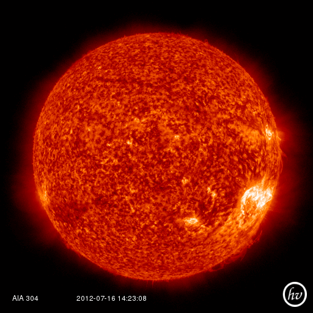
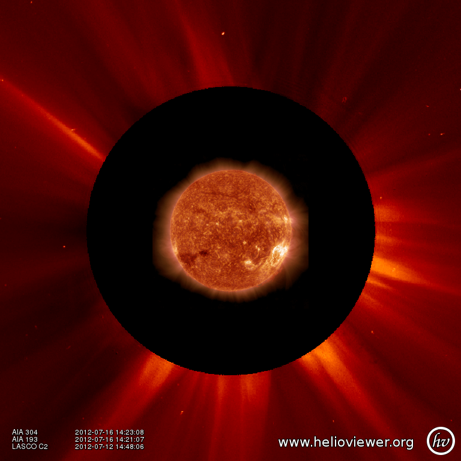

-----------------------------------
Querying Helioviewer.org with SunPy
-----------------------------------
SunPy can be used to make several basic requests using the The `Helioviewer.org API <http://helioviewer.org/api/>`__
including generating a PNG and downloading a `JPEG 2000 <http://wiki.helioviewer.org/wiki/JPEG_2000>`__
image and loading it into a SunPy Map.

The SunPy Helioviewer client requires installing two other pieces of software.
The first - OpenJPEG - is an open source library for reading and writing JPEG2000 
files.  To install OpenJPEG, please follow the instructions at `the OpenJPEG 
homepage <http://www.openjpeg.org>`__ .  The other package you will need is
the Python Imaging Library (PIL).  PIL can be obtained from 
`here <http://www.pythonware.com/products/pil/>`__.
Please follow the instructions there to install (note that PIL may ask you to
install other packages too).  The reason that two packages are required is
because matplotlib natively only reads in PNG files, and OpenJPEG 
does not write PNG files.
PIL is needed because the OpenJPEG command j2k_to_image (which converts a JPEG2000
file to other file formats) does not support outputting to PNG, and PNG is the 
only format Matplotlib can read in by itself. Matplotlib falls back to trying PIL 
when it encounters the intermediate image format we use; hence, PIL is required.

To interact with the Helioviewer API, users first create a "HelioviewerClient"
instance. The client instance can then be used to make various queries against
the API using the same parameters one would use when making a web request.

Nearly all requests require the user to specify the data they are interested in
and this can be done using one of two methods:

1. Call "get_data_sources()" to get a list of the data that is available, and use the source id numbers referenced in the result to refer to a particular dataset, or,
2. Specify the four components of a Helioviewer.org data source or layer: *observatory*, *instrument*, *detector* and *measurement*.

Let's begin by getting a list of data sources available on the server
using the get_datasources method::

    from sunpy.net.helioviewer import HelioviewerClient
    
    hv = HelioviewerClient()
    datasources = hv.get_data_sources()
    
    # print a list of datasources and their associated ids
    for observatory, instruments in datasources.items():
        for inst, detectors in instruments.items():
            for det, measurements in detectors.items():
                for meas, params in measurements.items():
                    print("%s %s: %d" % (observatory, params['nickname'], params['sourceId']))
                    
Suppose we next want to download a PNG image of the latest
AIA 304 image available on Helioviewer.org. We could use the explicit 
approach: ::

    hv.download_png('2099/01/01', 4.8, "[SDO,AIA,AIA,304,1,100]", x0=0, y0=0, width=512, height=512)

Where 4.8 refers to the image resolution in arcseconds per pixel (larger values 
mean lower resolution), the "1" and "100" in the layer string refer to the
visibility (visible/hidden) and opacity, x0 and y0 are the center points about 
which to focus and the width and height are the pixel values for the image 
dimensions.

The result is:

If we find that the source id for AIA 304 is is 13, we could make the same
request using: ::
    
    hv.download_png('2099/01/01', 4.8, "[13,1,100]", x0=0, y0=0, width=512, height=512)
    
Now suppose we wanted to create a composite PNG image using data from two 
different AIA wavelengths and LASCO C2 coronagraph data. The layer string is
extended to include the additional data sources, and opacity is throttled
down for the second AIA layer so that it does not completely block out the
lower layer: ::

    hv.download_png('2099/01/01', 6, "[SDO,AIA,AIA,304,1,100],[SDO,AIA,AIA,193,1,50],[SOHO,LASCO,C2,white-light,1,100]", x0=0, y0=0, width=768, height=768)

The result looks like:

Next, let's see how we can download a JPEG 2000 image and load it into a SunPy
Map object.

The overall syntax is similar to the *download_png* request, expect instead of
specifying a single string to indicate which layers to use, here we
can specify the values as separate keyword arguments: ::

    filepath = hv.download_jp2('2012/07/05 00:30:00', observatory='SDO', instrument='HMI', detector='HMI', measurement='continuum')
    hmi = sunpy.make_map(filepath)
    hmi.submap([200,550],[-400,-200]).show()

.. image:: ../images/helioviewer_download_jp2_ex.png

For more information about using querying Helioviewer.org, see the Helioviewer.org
API documentation at: `http://helioviewer.org/api/ <http://helioviewer.org/api/>`__.