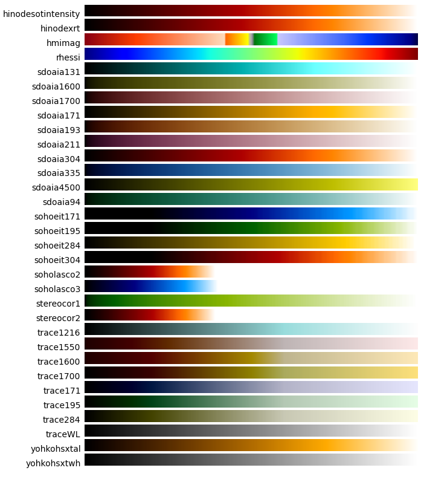

-----------------
Plotting in SunPy
-----------------

SunPy makes use of `matplotlib <http://matplotlib.org/>` for all of its plotting needs 
as such tries to follow the matplotlib plotting philosophy. 
It is therefore useful to go over how matplotlib works as background.

1. Matplotlib Tutorial
----------------------
The tutorial provided here is a summary of one that can be found in the `matplotlib
usage documentation <http://matplotlib.org/faq/usage_faq.html/>`.

Matplotlib provides two main pathways for plotting. One is meant for interactive use
(e.g. command-line) and the other for non-interactive use (e.g. modules). It is important
to recognize though that the interactive-use pathway (referred to as pyplot) just
provides shortcuts doing many of the more advanced non-interactive functions in the 
background. It is therefore possible to switch between the two as necessary and
convenient and it is possible to use pyplot in non-interactive way. In this manner pyplot
is just a shortcut making it quicker to set up plot axes and figures. 
In order to get access to the full interactive capabilities of pyplot it is
necessary to turn this feature on. This will be discussed below.
Pylab is another matplotlib usage scenario but it is essentially just pyplot with the
interactive capabilities turned on and numpy and matplotlib imported into the main 
namespace.

2. Pyplot
---------
Here is an example of pyplot usage ::

    import matplotlib.pyplot as plt

    plt.plot(range(10), range(10))
    plt.title("A simple Plot")
    plt.show()

The show() command open a plot on the screen and blocks execution (meaning you can't 
do anything with the prompt or your script freezes) until the plot window is closed. For 
reasons that are not very clear, the creators of matplotlib designed the show() command
so that it would only work once. If you were to call show() on the plt object again 
after the above code is executed nothing happens. Apparently, this confusing behavior 
is something that the matplotlib devs get complaints about often and so this may change
in the future (or may already have changed depending on your choice of backend). 
A discussion about this can be found `here 
<http://stackoverflow.com/questions/5524858/matplotlib-show-doesnt-work-twice>`.
Don't be confused by another command called draw(). This is only used while in interactive
mode. 

To turn on interactivity for pyplot use the command ::
    
    plt.ion()
    
In interactive mode, the plot will appear at the first plot() command and most 
commands will update the plot as you call them. Here is an example ::

    plt.plot(range(10), range(10))
    plt.title("Simple Plot")
    
In this example, you'll see that the title appears right on the plot when you call it.
Note that in this case the show command is useless as the plot shows up right when you
create it. Also note that some commands will not automatically update the plot and
you have to use the draw() command. The following command ::

    plt.ioff()
    
turns off interactivity.

3. Advanced Pyplot
------------------
If you need more fine-grained control over plots the recommended path is to use pyplot
and access the figures and axes objects. Here is an example ::

    import matplotlib.pyplot as plt
    import numpy as np
    
    x = np.arange(0, 10, 0.2)
    y = np.sin(x)
    
    fig = plt.figure()
    ax = fig.add_subplot(111)
    ax.plot(x, y)
    
    plt.show()

Figure is the top-level container for all plot elements and axes is the top-level container
for a particular plot. So the above example, creates a figure then creates an axes
and then uses the pyplot plot() method to populate the plot in ax. You generally don't need
to mess with the figure object but with this method you now have your hands on the ax
object so you can do this like change the labels on the x and y axes or add a legend, etc.
do whatever you want to it. In the previous section, pyplot took care of creating these
objects for you so you don't have to worry about creating them yourself.

4. SunPy Plotting Standards
---------------------------

To be consistent with matplotlib, SunPy has developed a standard plotting policy which 
supports both simple and advanced matplotlib usage. 

5. peek()
---------

For quick and easy access to a plot
all sunpy base objects (e.g. map, spectra, lightcurve) define their own peek() command.
For example you can do the following ::

    import sunpy
    
    smap = sunpy.Map(sunpy.EIT_195_IMAGE)
    smap.peek(draw_limb=True)

This creates a plot window with all axes defined, a plot title, and the image of the map
data all defined by the contents of the map. As this is command makes use of show(), in non-interactive 
mode the plot window blocks and must be closed before doing anything else. This is meant as a 
quick way to visualize the contents of a sunpy object you've created.

6. plot()
---------

For more advanced plotting the base sunpy objects also provide a plot() command. This
command is similar to the pyplot plot() command in that it will create a figure and axes
object for you if you haven't already. It returns a figure object and does not create a
plot window. With the figure object in your hands you can reach in and grab the axes
and therefore manipulate the plot as you see fit. Here is an example of this at work ::

    import sunpy
    import matplotlib.pyplot as plt
    
    smap = sunpy.Map(sunpy.EIT_195_IMAGE)
    smap.plot()
    smap.draw_limb()
    
    plt.show()

This output of this example is equivalent to one in the previous section. The map.plot()
command is equivalent to ax.plot(x,y) command which we introduced in section 3. Similar
to that command it will create a figure for you if you haven't created on yourself. For
advanced plotting you'll want to create it yourself. ::

    fig = plt.figure()
    ax = plt.subplot(1,1,1)
    
    smap.plot()
    plt.colorbar()    
    ax.plot([-1000,1000], [0,0], color="white")
    
    plt.show()

The above a plot of line across the map. Using the fig.gca() command to get access to the
axes object most anything can be done to the plot and the plot can be displayed as usual
using the show() command. Here is another example ::

    from matplotlib import patches
    fig = plt.figure()
    ax = plt.subplot(1,1,1)
    
    smap.plot()
    rect = patches.Rectangle([-350, -650], 500, 500, color = 'white', fill=False)
    ax.add_artist(rect)
    
    plt.show()
    
Finally, here is a more complex example, starting from the beginning::

    from matplotlib import patches
    import sunpy
    import matplotlib.pyplot as plt
    smap = sunpy.Map(sunpy.AIA_171_IMAGE)
    submap = map.submap([-100-250, -100+250], [-400-250, -400+250])
    rect = patches.Rectangle([-100-250, -400-250], 500, 500, color = 'white', fill=False)
        
    fig = plt.figure()
    ax1 = fig.add_subplot(2,1,1)
    smap.plot()
    ax1.add_artist(rect)
    
    ax2 = fig.add_subplot(2,1,2)
    submap.plot()
    submap.draw_grid(grid_spacing=10)
    ax2.set_title('submap')
    fig.subplots_adjust(hspace=0.4)
    
    plt.show()

The above example creates two side by side plots one with the overall view of the Sun
with a small area marked with a white box. That smaller view is then shown in the plot
below it. The spacing between the two plots is controlled by fig.subplots_adjust().

7. Specifying a Colormap
------------------------

There are a number of color maps defined in SunPy which are used for data from 
particular missions (e.g. SDO/AIA). 
A simple example on how to use the color maps provided by SunPy: ::

    from sunpy.cm import cm
    
    # cmlist is a dictionary with all of the color tables
    # to list all of the keys of the dictionary
    cm.cmlist.keys()

    # to grab a particular colortable then
    cmap = cm.cmlist.get('sdoaia94')

    # you can also get a visual representation of all of the color tables 
    cm.show_colormaps()

These can be used with the standard commands to change the colormap::

    import sunpy
    from sunpy.cm import cm

    cmap = cm.cmlist.get('sdoaia94')
    smap = sunpy.Map(sunpy.AIA_171_IMAGE)
    
    fig = plt.figure()
    ax = plt.subplot(1,1,1)
    smap.plot(cmap=cmap)
    plt.show()
