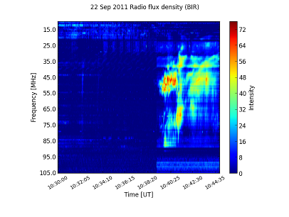
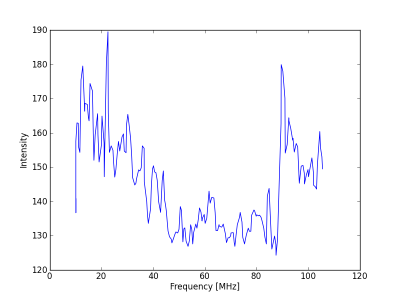
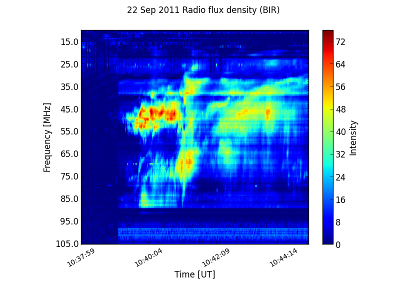
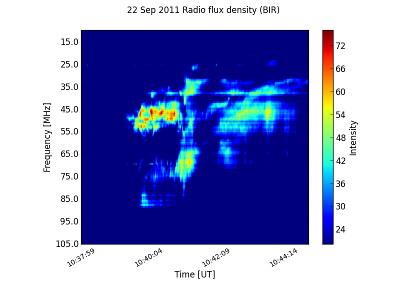
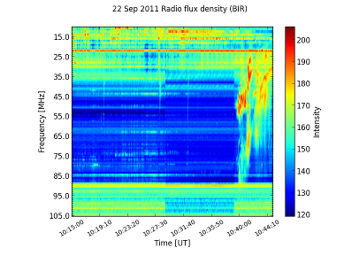
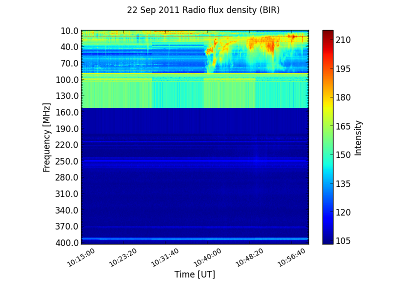

-------
Spectra
-------

Spectrograms
------------
SunPy currently supports reading dynamic spectra from e-Callisto_ instruments.
The main class that is used for this is
:py:class:`sunpy.spectra.sources.callisto.CallistoSpectrogram`. SunPy also
comes with an example image that shows a radio burst observerd at `Ross Observatory`_ (aka. BIR; Birr Castle, Co. Offaly, Ireland) that
can be found in sunpy.CALLISTO_IMAGE

    >>> from matplotlib import pyplot as plt
    >>> import sunpy
    >>> from sunpy.spectra.sources.callisto import CallistoSpectrogram
    >>> image = CallistoSpectrogram.read(sunpy.CALLISTO_IMAGE)

You can now view the image by using the :py:meth:`show` method.

    >>> image.show()

.. image:: ../images/spectra_ex1.png

You can then perform automatic constant background subtraction by using the
:py:meth:`subtract_bg` method. The resulting image will be clipped at 0
using the min_ parameter of show in order to avoid negative values.

    >>> nobg = image.subtract_bg()
    >>> nobg.show(min_=0)

If you want to see the background determined by the automatic subtraction,
you can use the :py:meth:`auto_const_bg` method and visualize the resulting
data using :py:func:`pyplot.plot`.

    >>> bg = image.auto_const_bg()
    >>> plt.plot(image.freq_axis, bg)
    >>> plt.show() # This might not be necessary if you are using pylab.

Now let us say we want to isolate the interesting bit (which starts around
10:38) from the boring background; there is a method called
:py:meth:`in_interval` that allows us to take the part of an image that is
within a specified interval. Leaving out the second argument it defaults
to the end time of the file.

    >>> interesting = nobg.in_interval("10:38")
    >>> interesting.show(min_=0)

To get rid of the noise, we could also clip low intensities.

    >>> interesting.show(min_=20)

If we want more context, we can also join together different images into
a large one in time (note that this does more than just concatenating the
array and the axes -- it also considers possible overlap or gaps).

    >>> c1 = CallistoSpectrogram.read("BIR_20110922_101500_01.fit")
    >>> c2 = CallistoSpectrogram.read("BIR_20110922_103000_01.fit")
    >>> d = CallistoSpectrogram.join_many([c1, c2])
    >>> d.show()

We could also get the from_range method to get data between those two points
directly from the archive and joined together (though that will fetch all
frequencies of BIR).

    >>> d = CallistoSpectrogram.from_range("BIR", "2011-09-22T10:15:00", "2011-09-22T10:45:00")
    >>> d.show()

.. _e-Callisto: http://www.e-callisto.org/
.. _Ross Observatory: http://rosseobservatory.ie/ 
