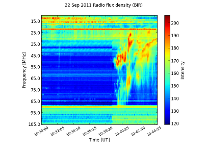
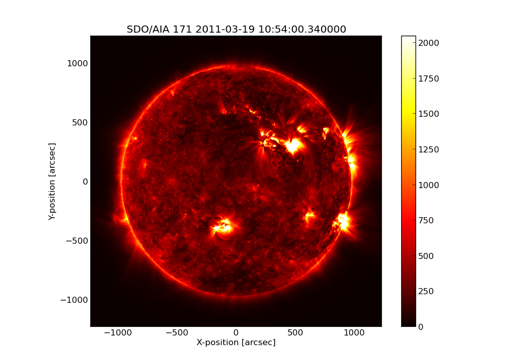
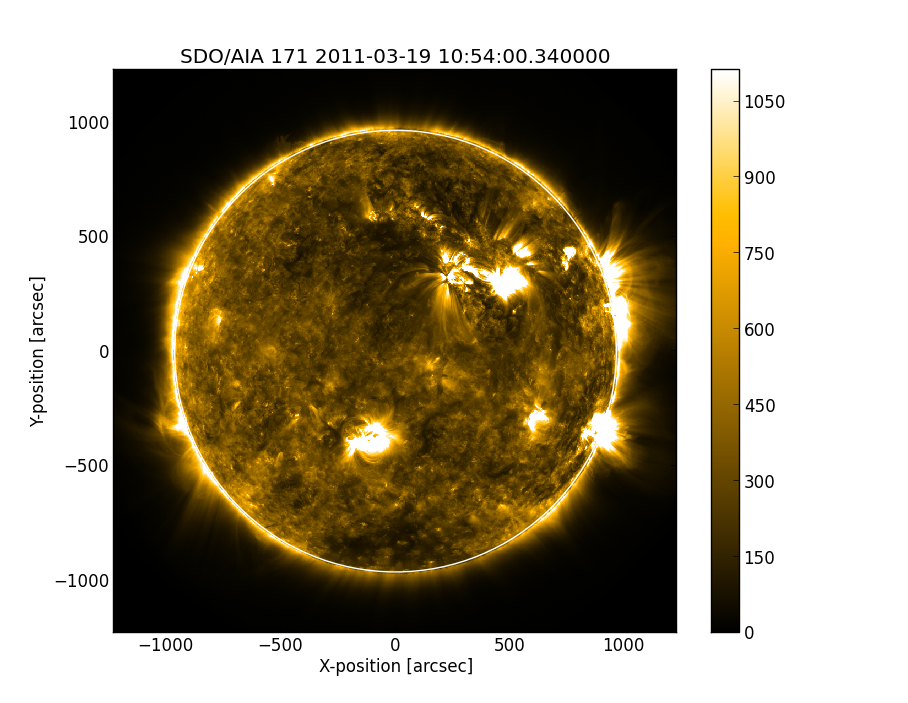

---------------------
A brief tour of SunPy
---------------------

Welcome to the SunPy tutorial! This brief tutorial will walk you through some
of the functionality currently offered by SunPy. Start by reading this tutorial
and trying out some of the examples demonstrated. Once you've completed the
tutorial check out the rest of the :doc:`User Guide </guide/index>` for a more
thorough look at the functionality available.

Sample Data
-----------
This tour makes use of a number of sample data files which you will need to
download. To download the sample files simply run the following command::

    import sunpy.data
    sunpy.data.download_sample_data()

After running this you can then import the sample data files shortcuts which
are used below (e.g. sunpy.data.sample) by simply importing the module like so::

    import sunpy.data.sample

If the sample files are not available for some reason that you will get an error
on import.

Maps
----
Maps are the primary data type in SunPy they are spatially and / or temporally aware
data arrays. There are maps for a 2D image, a time series of 2D images or temporally aligned 2D images.
Making a map of your data is the normally the first step in using SunPy to work with your data.

**Creating a Map**

SunPy supports many different data products from various sources 'out of the box' we
shall use SDO's AIA instrument as an example in this tutorial. The general way to create
a map from one of the supported data products is with the `Map()` class from the `map` submodule.

`Map()` takes either a filename, a list of filenames or a data array and header pair. We can test map with::

    import sunpy.map
    aia = sunpy.map.Map(sunpy.data.sample.AIA_171_IMAGE)

This returns a map named `aia` which can be manipulated with standard SunPy map commands.
For more information about maps checkout the :doc:`map guide <data_types/maps>`.

Lightcurve
----------

SunPy handles time series data, fundamental to the study of any real world phenomenon,
by creating a lightcurve object. Currently lightcurve supports

- SDO/EVE
- GOES XRS
- PROBA2/LYRA

A lightcurve consists of two parts; times and measurements taken at those times. The
data can either be in your current Python session, alternatively within a local or
remote file. Let's create some fake data and pass it into a lightcurve object::

    >>> from sunpy.lightcurve import LightCurve
    >>> light_curve = LightCurve.create({"param1": range(24*60)})

Within LightCurve.create, we have a dictionary that contains a single entry with key
"param1" containing a list of 1440 entries (0-1439). As there are no times provided,
so a default set of times are generated.

Spectra
-------

SunPy has spectral support for instruments which have such a capacity. CALLISTO,
an international network of Solar Radio Spectrometers, is a specific example.
Below is the example built into sunpy::

    import matplotlib.pyplot as plt
    import sunpy.spectra

    from sunpy.spectra.sources.callisto import CallistoSpectrogram
    image = CallistoSpectrogram.read(sunpy.data.sample.CALLISTO_IMAGE)

    image.peek()

Plotting
--------

Let's begin by creating a simple plot of an AIA image. To make things easy,
SunPy includes several example files which are used throughout the docs. These
files have names like `sunpy.data.sample.AIA_171_IMAGE` and `sunpy.data.sample.RHESSI_IMAGE`.

Try typing the below example into your interactive Python shell::

    import sunpy.map
    aia = sunpy.map.Map(sunpy.data.sample.AIA_171_IMAGE)
    aia.peek()

If everything has been configured properly you should see an AIA image with
a red colormap, a colorbar on the right-hand side and a title and some
labels.

There is lot going on here, but we will walk you through the example. Briefly,
the first line is just importing SunPy. On the second line we create a
SunPy Map object which is basically just a spatially-aware image or data array.
On the last line we then plot the map object, using the built in 'quick plot' function `peek()`.

SunPy uses a matplotlib like interface to it's plotting so more complex plots can be built by combining
SunPy with matplotlib::

    import sunpy.map
    import matplotlib.pyplot as plt

    aia = sunpy.map.Map(sunpy.data.sample.AIA_171_IMAGE)

    fig = plt.figure()
    ax = plt.subplot(111)

    aia.plot()
    plt.colorbar()
    aia.draw_limb()

    plt.show()

This should output something like the image below:

Solar Physical Constants
------------------------

SunPy contains a convenient list of solar-related physical constants. Here is
a short bit of code to get you started: ::

    from sunpy.sun import constants as con

    # one astronomical unit (the average distance between the Sun and Earth)
    print con.au

    # the solar radius
    print con.radius

Not all constants have a shortcut assigned to them (as above). The rest of the constants
are stored in a dictionary. The following code grabs the dictionary and gets all of the
keys.::

    solar_constants = con.physical_constants
    solar_constants.keys()

You can also use the following function to print out a table of all of the values
available. ::

    con.print_all()

These constants are provided as a convenience so that everyone is using the same
(accepted values). More will be added over time.

Quantities and Units
--------------------

Many capabilities in SunPy make use of physical quantities that are specified
in units. SunPy uses `astropy's units and quantities code <http://docs.astropy.org/en/stable/units/index.html>`__ to
implement this functionality. For example, the solar radius above is a physical quantity
that can be expressed in length units.  In the example above ::

    >>> from sunpy.sun import constants as con
    >>> con.radius
    <Constant name=u'Solar radius' value=695508000.0 error=26000.0 units='m' reference=u"Allen's Astrophysical Quantities 4th Ed.">

shows the solar radius in units of meters.  It is simple to express the same physical quantity in different units::

    >>> con.radius.to('km')
    <Quantity 695508.0 km>

To get the numerical value of the solar radius in kilometers - without the unit information - use ::

    >>> con.radius.to('km').value
    695508.0

Quantities and units are simple and powerful tools for keeping track of the units you're working in, and make it
easy to convert the same physical quantity into different units.  To learn more about the capabilities of quantities
and units, please consult `the astropy tutorial <http://www.astropy.org/astropy-tutorials/Quantities.html>`__.
SunPy's approach to the adoption of quantities and units in the codebase is described
`here <https://github.com/sunpy/sunpy-SEP/blob/master/SEP-0003.md>`__.

Here's a simple example of the power of units.  Suppose you have the radius of a circle and would like to calculate
its area.  The following code implements this ::

    >>> import numpy as np
    >>> import astropy.units as u
    >>> @u.quantity_input(radius=u.m)
    >>> def circle_area(radius):
            return np.pi * radius ** 2

The first line imports numpy, and the second line imports astropy's units module.  The beginning of the third line (the
"@" symbol) indicates that what follows is a Python decorator.  In this case, the decorator allows us to specify what
kind of unit the function input variable "radius" in the following function "circle_area" should have.  In this case,
it is meters.  The decorator checks that the input is convertible to the units specified in the decorator.  Calculating
the area of a circle with radius 4 meters using the function defined above is simple ::

    >>> circle_area(4 * u.m)
    <Quantity 50.26548245743669 m2>

The units of the returned area are what we expect, namely the meters squared (m2).  However, we can also use other
units of measurement; for a circle with radius 4 kilometers ::

    >>> circle_area(4 * u.km)
    <Quantity 50.26548245743669 km2>

Even although the input value of the radius was not in meters, the function does not crash; this is because the
input unit is convertible to meters.  This also works across different systems of measurement, for example ::

    >>> circle_area(4 * u.imperial.foot)
    <Quantity 50.26548245743669 ft2>

However, if the input unit is not convertible to meters, then an error is thrown ::

    >>> circle_area(4 * u.second)
    ---------------------------------------------------------------------------
    UnitsError                                Traceback (most recent call last)
    <ipython-input-15-5d2b19807321> in <module>()
    ----> 1 circle_area(4 * u.second)

    /Users/ireland/anaconda/lib/python2.7/site-packages/astropy/utils/decorators.py in circle_area(radius)
        515     def wrapper(func):
        516         func = make_function_with_signature(func, name=wrapped.__name__,
    --> 517                                             **_get_function_args(wrapped))
        518         func = functools.update_wrapper(func, wrapped, assigned=assigned,
        519                                         updated=updated)

    /Users/ireland/anaconda/lib/python2.7/site-packages/astropy/units/decorators.pyc in wrapper(*func_args, **func_kwargs)
        112                                              " '{2}'.".format(param.name,
        113                                                      wrapped_function.__name__,
    --> 114                                                      target_unit.to_string()))
        115
        116                     # Either there is no .unit or no .is_equivalent

    UnitsError: Argument 'radius' to function 'circle_area' must be in units convertable to 'm'.

Also, if no unit is specified, an error is thrown ::

    >>> circle_area(4)
    ---------------------------------------------------------------------------
    TypeError                                 Traceback (most recent call last)
    <ipython-input-17-4c9fa37f7920> in <module>()
    ----> 1 circle_area(4)

    /Users/ireland/anaconda/lib/python2.7/site-packages/astropy/utils/decorators.py in circle_area(radius)
        515     def wrapper(func):
        516         func = make_function_with_signature(func, name=wrapped.__name__,
    --> 517                                             **_get_function_args(wrapped))
        518         func = functools.update_wrapper(func, wrapped, assigned=assigned,
        519                                         updated=updated)

    /Users/ireland/anaconda/lib/python2.7/site-packages/astropy/units/decorators.pyc in wrapper(*func_args, **func_kwargs)
        122                         raise TypeError("Argument '{0}' to function has '{1}' {2}. "
        123                               "You may want to pass in an astropy Quantity instead."
    --> 124                                  .format(param.name, wrapped_function.__name__, error_msg))
        125
        126             # Call the original function with any equivalencies in force.

    TypeError: Argument 'radius' to function has 'circle_area' no 'unit' attribute. You may want to pass in an astropy Quantity instead.

Using units allows the user to be explicit about what the function
expects.  Units also make conversions very easy to do.  For example,
if you want the area of a circle in square feet, but were given
measurements in meters, then ::

    >>> circle_area((4 * u.m).to(u.imperial.foot))
    <Quantity 541.0531502245425 ft2>

or ::

    >>> circle_area(4 * u.m).to(u.imperial.foot ** 2)
    <Quantity 541.0531502245425 ft2>

Astropy units and quantities are very powerful, and are used throughout SunPy.  To find out more about units and
quantities, please consult the `the astropy tutorial <http://www.astropy.org/astropy-tutorials/Quantities.html>`__ and
`documentation <http://docs.astropy.org/en/stable/units/index.html>`__

Working with Times
------------------

SunPy also contains a number of convenience functions for working with dates
and times. Here is a short example: ::

    import sunpy.time

    # parsing a standard time strings
    sunpy.time.parse_time('2004/02/05 12:00')

    # This returns a datetime object. All SunPy functions which require
    # time as an input sanitize the input using parse_time.
    sunpy.time.day_of_year('2004-Jul-05 12:00:02')

    # the julian day
    sunpy.time.julian_day((2010,4,30))

    # TimeRange objects are useful for representing ranges of time
    sunpy.time.time_range = TimeRange('2010/03/04 00:10', '2010/03/04 00:20')
    time_range.center()

For more information about working with time in SunPy checkout the :doc:`time guide <time>`.

Getting at Data
---------------

Querying the VSO
----------------
There are a couple different ways to query and download data from the VSO using
SunPy. The method you should use depends first on your preference with respect
to query style: the main method of querying uses a syntax that is unique to
SunPy and may require some getting used to, but is extremely flexible and
powerful. To make it easy for people coming from SSW to get started, a second
"legacy" API also exists which works is very much the same way as VSO_GET in
IDL.

Further, for each of the two query APIs there are interactive and
non-interactive versions available, depending on the type of work you are doing.

The below example demonstrates a simple query for SOHO EIT data using the
non-interactive version of the main API::

    from sunpy.net import vso

    # create a new VSOClient instance
    client = vso.VSOClient()

    # build our query
    result = client.query(
        vso.attrs.Time((2011, 9, 20, 1), (2011, 9, 20, 2)),
        vso.attrs.Instrument('eit')
    )

    # print the number of matches
    print("Number of records found: %d " % result.num_records())

    # download matches to /download/path
    res = client.get(result, path="/download/path/{file}").wait()

Note that specifying a path is optional and if you do not specify one the files
will simply be downloaded into a temporary directory (e.g. /tmp/xyz).
For more information about vso client checkout the :doc:`vso guide <acquiring_data/vso>`.

Database Package
----------------

The database package offers the possibility to save retrieved data (e.g. via the
:mod:'sunpy.net.vso' package) onto a local or remote database. The database may be
a single file located on a local hard drive (if a SQLite database is used) or a
local or remote database server.
This makes it possible to fetch required data from the local database instead
of downloading it again from a remote server.

Querying a database is straightforward, as this example using VSO, shows. The example
demonstrates the useful feature which prevents storing the same data twice::

    >>> from sunpy.database import Database
    >>> from sunpy.net.vso.attrs import Time, Instrument
    >>> db = Database('sqlite:///')
    >>> entries = db.fetch(
    ...     Time('2012-08-05', '2012-08-05 00:00:05'),
    ...     Instrument('AIA'))
    >>> assert entries is None
    >>> len(db)
    2
    >>> entries = db.fetch(
    ...     Time('2012-08-05', '2012-08-05 00:00:05'),
    ...     Instrument('AIA'))
    >>> entries is None
    False
    >>> len(entries)
    2
    >>> len(db)
    2

Explanation: first, entries is None because the query has never been used for querying
the database -> query the VSO, add new entries to database, remember query hash.
In the second fetch, entries is not None because the query has already been used and
returns a list of database entries.

Querying Helioviewer.org
------------------------

SunPy can be used to make several basic requests using the The `Helioviewer.org API <http://helioviewer.org/api/>`__
including generating a PNG and downloading a `JPEG 2000 <http://wiki.helioviewer.org/wiki/JPEG_2000>`__
image and loading it into a SunPy Map.

A simple example of a helioviewer query is::

    from sunpy.net.helioviewer import HelioviewerClient

    hv = HelioviewerClient()
    hv.download_png('2099/01/01', 4.8, "[SDO,AIA,AIA,304,1,100]", x0=0, y0=0, width=512, height=512)

This downloads a PNG image of the latest AIA 304 image available on
Helioviewer.org in the `download_png` command 4.8 refers to the image resolution
in arcseconds per pixel (larger values mean lower resolution), the "1" and "100" in the
layer string refer to the visibility (visible/hidden) and opacity,
x0 and y0 are the center points about which to focus and the width and height
are the pixel values for the image dimensions.

The result is:

.. image:: ../images/helioviewer_download_png_ex1.png

For more information checkout the :doc:`helioviewer guide <acquiring_data/helioviewer>`.
