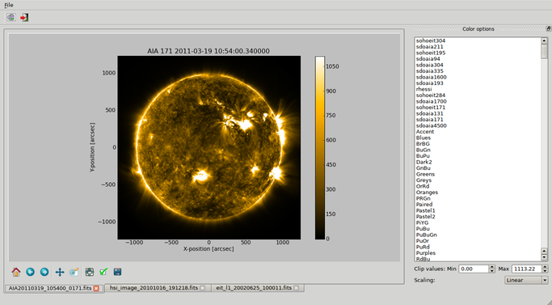

----------------
A brief tour of SunPy
----------------

Welcome to the SunPy tutorial! This brief tutorial will walk you through some 
of the functionality currently offered by SunPy. Start by reading this tutorial
and trying out some of the examples demonstrated. Once you've completed the
tutorial check out the :doc:`code reference</reference/index>` for a more
thorough look at the functionality available.

1. Plotting
-----------

Let's begin by creating a simple plot of an AIA image. To make things easy,
SunPy includes several example files which are used throughout the docs. These
files have names like `sunpy.AIA_171_IMAGE` and `sunpy.RHESSI_IMAGE`.

Try typing the below example into your interactive Python shell::

    import sunpy
    from matplotlib import cm
    from matplotlib import colors
    aia = sunpy.make_map(sunpy.AIA_171_IMAGE)
    aia.show(cmap=cm.hot, norm=colors.Normalize(1, 2048))

If everything has been configured properly you should see an AIA image with
a red colormap, a colorbar on the right-hand side and a title and some 
labels.

.. image:: ../images/plotting_ex1.png

There is lot going on here, but we will walk you through the example. Briefly,
in the first few lines we are just importing SunPy and a couple other plotting
related modules that we will use in the example. On the fourth line we create a
SunPy Map object which is basically just a spatially-aware image or data array.
On the last line we then plot the map object, adding a couple additional
parameters to specify a color map to use and how we wish to scale the image.

Over the next few sections we will explain some of these features in more depth
and then move onto more other modules included in SunPy.

**Specifying a Colormap**

There are a number of color maps defined in SunPy which are used for data from 
particular missions (e.g. SDO/AIA). 
A simple example on how to use the color maps provided by SunPy: ::

    from sunpy.cm import cm
    
    # cmlist is a dictionary with all of the color tables
    # to list all of the keys of the dictionary
    cm.cmlist.keys()

    # to grab a particular colortable then
    cmap = cm.cmlist.get('sdoaia94')

    # you can also get a visual representation of all of the color tables 
    cm.show_colormaps()
.. image:: ../images/plotting_ex2.png

2. Solar Physical Constants
---------------------------

SunPy contains a convienient list of solar-related physical constants. Here is 
a short bit of code to get you started: ::
    
    from sunpy.sun import constants as con

    # one astronomical unit (the average distance between the Sun and Earth)
    print(con.au)

    # the solar radius
    print(con.radius)

    # not all constants have a shortcut assigned to them (as above)
    # the rest of the constants are stored in a dictionary
    solar_constants = con.physical_constants

    # to get a list of all of the values stored in this dictionary
    solar_constants.keys()
    
    # or you can use the following convinience method to list them all
    con.print_all()

3. Working with Times
---------------------

SunPy also contains a number of convenience functions for working with dates
and times. Here is a short example: ::

    from sunpy.time import *
    
    # parsing a standard time strings
    parse_time('2004/02/05 12:00')
    
    # This returns a datetime object. All SunPy functions which require 
    # time as an input sanitize the input using parse_time.
    day_of_year('2004-Jul-05 12:00:02')
    
    # the julian day
    julian_day((2010,4,30))
    
    # TimeRange objects are useful for representing ranges of time
    time_range = TimeRange('2010/03/04 00:10', '2010/03/04 00:20')
    time_range.center()
    
4. Querying the VSO
-------------------
There are a couple different ways to query and download data from the VSO using
SunPy. The method you should use depends first on your preference with respect
to query style: the main method of querying uses a syntax that is unique to
SunPy and may require some getting used to, but is extremely flexible and
powerful. To make it easy for people coming from SSW to get started, a second
"legacy" API also exists which works is very much the same way as VSO_GET in
IDL.

Further, for each of the two query APIs there are interactive and
non-interactive versions available, depending on the type of work you are doing.

The below example demonstrates a simple query for SOHO EIT data using the
non-interactive version of the main API::

    from sunpy.net import vso
    
    # create a new VSOClient instance
    client = vso.VSOClient()
    
    # build our query
    result = client.query(
        vso.attrs.Time((2011, 9, 20, 1), (2011, 9, 20, 2)),
        vso.attrs.Instrument('eit')
    )
    
    # print the number of matches
    print("Number of records found: %d " % result.num_records())
   
    # download matches to /download/path
    res = client.get(result, path="/download/path/{file}").wait()

Note that specifying a path is optional and if you do not specify one the files
will simply be downloaded into a temporary directory (e.g. /tmp/xyz).

5. Querying Helioviewer.org
---------------------------
SunPy can be used to make several basic requests using the The `Helioviewer.org API <http://helioviewer.org/api/>`__
including generating a PNG and downloading a `JPEG 2000 <http://wiki.helioviewer.org/wiki/JPEG_2000>`__
image and loading it into a SunPy Map.

To interact with the Helioviewer API, users first create a "HelioviewerClient"
instance. The client instance can then be used to make various queries against
the API using the same parameters one would use when making a web request.

Nearly all requests require the user to specify the data they are interested in
and this can be done using one of two methods:

1. Call "get_data_sources()" to get a list of the data that is available, and use the source id numbers referenced in the result to refer to a particular dataset, or,
2. Specify the four components of a Helioviewer.org data source or layer: *observatory*, *instrument*, *detector* and *measurement*.

Let's begin by getting a list of data sources available on the server
using the get_datasources method::

    from sunpy.net.helioviewer import HelioviewerClient
    
    hv = HelioviewerClient()
    datasources = hv.get_data_sources()
    
    # print a list of datasources and their associated ids
    for observatory, instruments in datasources.items():
        for inst, detectors in instruments.items():
            for det, measurements in detectors.items():
                for meas, params in measurements.items():
                    print("%s %s: %d" % (observatory, params['nickname'], params['sourceId']))
                    
Suppose we next want to download a PNG image of the latest
AIA 304 image available on Helioviewer.org. We could use the explicit 
approach: ::

    hv.download_png('2099/01/01', 4.8, "[SDO,AIA,AIA,304,1,100]", x0=0, y0=0, width=512, height=512)

Where 4.8 refers to the image resolution in arcseconds per pixel (larger values 
mean lower resolution), the "1" and "100" in the layer string refer to the
visibility (visible/hidden) and opacity, x0 and y0 are the center points about 
which to focus and the width and height are the pixel values for the image 
dimensions.

The result is:

.. image:: ../images/helioviewer_download_png_ex1.png

If we find that the source id for AIA 304 is is 13, we could make the same
request using: ::
    
    hv.download_png('2099/01/01', 4.8, "[13,1,100]", x0=0, y0=0, width=512, height=512)
    
Now suppose we wanted to create a composite PNG image using data from two 
different AIA wavelengths and LASCO C2 coronagraph data. The layer string is
extended to include the additional data sources, and opacity is throttled
down for the second AIA layer so that it does not completely block out the
lower layer: ::

    hv.download_png('2099/01/01', 6, "[SDO,AIA,AIA,304,1,100],[SDO,AIA,AIA,193,1,50],[SOHO,LASCO,C2,white-light,1,100]", x0=0, y0=0, width=768, height=768)

The result looks like:

.. image:: ../images/helioviewer_download_png_ex2.png

Next, let's see how we can download a JPEG 2000 image and load it into a SunPy
Map object.

The overall syntax is similar to the *download_png* request, expect instead of
specifying a single string to indicate which layers to use, here we
can specify the values as separate keyword arguments: ::

    filepath = hv.download_jp2('2012/07/05 00:30:00', observatory='SDO', instrument='HMI', detector='HMI', measurement='continuum')
    hmi = sunpy.make_map(filepath)
    hmi.submap([200,550],[-400,-200]).show()

.. image:: ../images/helioviewer_download_jp2_ex.png

For more information about using querying Helioviewer.org, see the Helioviewer.org
API documentation at: `http://helioviewer.org/api/ <http://helioviewer.org/api/>`__.
 

6. Graphical plot manipulation
------------------------------

SunPy provides a basic GUI for plot manipulation which can be invoked interactively.
Note that the GUI requires `PyQt4 <http://www.riverbankcomputing.co.uk/software/pyqt/download>`__ 
and all its necessary dependencies to be installed before it can be used::
        
        from sunpy.gui import Plotman
        
        # Create a plotman instance with all plots in a directory
        plots = Plotman('data/examples')
        plots.show()

        # Create an instance with a single plot and show window.
        plot = Plotman(sunpy.AIA_171_IMAGE).show() 

Any of the built-in SunPy or matplotlib colormaps may be applied to the image, scaled linearly or logarithmically and clipped as appropriate. The range of matplotlib built-in functions is also available including panning, zooming, saving, axis and subplot configuration etc.

Multiple plots are handled in a tabbed interface within a single window.
