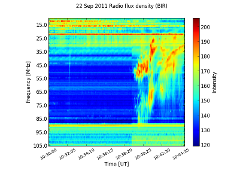
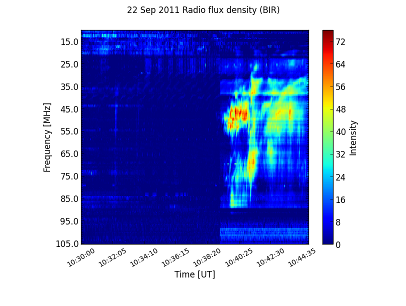
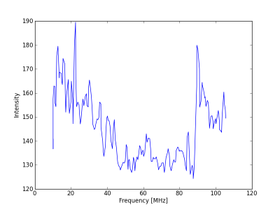
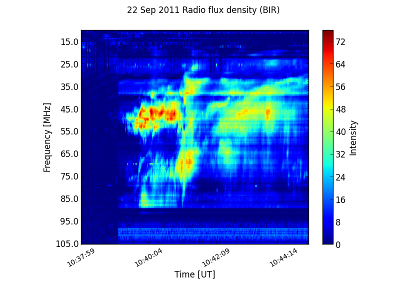
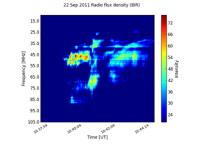
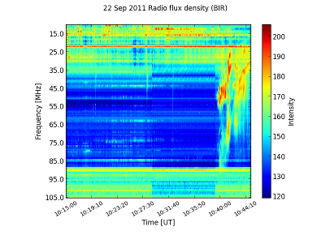
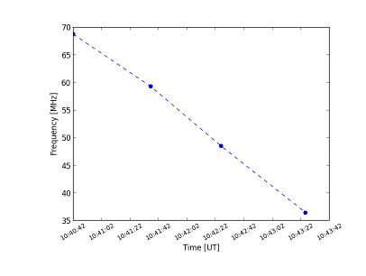

=======
Spectra
=======

.. warning:: This module is under development! Use at your own risk.

Spectrograms
------------
SunPy currently supports reading dynamic spectra from e-Callisto_ instruments.
The main class that is used for this is
:py:class:`CallistoSpectrogram <sunpy.spectra.sources.callisto.CallistoSpectrogram>`. SunPy also
comes with an example image that shows a radio burst observed at `Rosse Observatory`_ (aka. BIR; Birr Castle, Co. Offaly, Ireland) that
can be found in sunpy.CALLISTO_IMAGE: :: 

    from matplotlib import pyplot as plt
    import sunpy
    from sunpy.spectra.sources.callisto import CallistoSpectrogram
    image = CallistoSpectrogram.read(sunpy.CALLISTO_IMAGE)

You can now view the image by using the
:py:meth:`peek() <sunpy.spectra.spectrogram.Spectrogram.peek>`  method. ::

    image.peek()

We now notice that there seems to be something interesting that has been
cut off at the corner of the image, so we use the extend method to request
more data from the server. It optionally takes the amount of minutes we want
to request from the server (negative values mean we want to add data that was
registered before our existing local data), if none are given it defaults to
15 minutes (the size of one e-Callisto file).::

    more = image.extend()
    more.peek()
    
.. image:: ../images/spectra_ex3.5.png

We will, for the purposes of this demonstration, continue working with the
original image, though.

You can then perform automatic constant background subtraction by using the
:py:meth:`subtract_bg() <sunpy.spectra.spectrogram.Spectrogram.subtract_bg>`
method. The resulting image will be clipped at 0 using the min_ parameter of
peek in order to avoid negative values.::

    nobg = image.subtract_bg()
    nobg.peek(min_=0)

If you want to see the background determined by the automatic subtraction,
you can use the
:py:meth:`auto_const_bg() <sunpy.spectra.spectrogram.Spectrogram.auto_const_bg>` 
method and visualize the resulting
data using :py:func:`pyplot.plot`.::
    
    plt.figure()
    bg = image.auto_const_bg()
    plt.plot(image.freq_axis, bg)
    plt.xlabel("Frequency [MHz]")
    plt.ylabel("Intensity")
    plt.show() # This might not be necessary if you are using pylab.

Now let us say we want to isolate the interesting bit (which starts around
10:38) from the boring background; there is a method called
:py:meth:`in_interval() <sunpy.spectra.spectrogram.LinearTimeSpectrogram.in_interval>` 
that allows us to take the part of an image that is
within a specified interval. Leaving out the second argument it defaults
to the end time of the file.::

    interesting = nobg.in_interval("10:38")
    interesting.peek(min_=0)

To get rid of the noise, we could also clip low intensities.::

    interesting.peek(min_=20)

If we want more context, we can also join together different images into
a large one in time (note that this does more than just concatenating the
array and the axes -- it also considers possible overlap or gaps).::

    c1 = CallistoSpectrogram.read("BIR_20110922_101500_01.fit")
    c2 = CallistoSpectrogram.read("BIR_20110922_103000_01.fit")
    d = CallistoSpectrogram.join_many([c1, c2])
    d.peek()

We could also get the from_range method to get data between those two points
directly from the archive and joined together (though that will fetch all
frequencies of BIR).::

    d = CallistoSpectrogram.from_range("BIR", "2011-09-22T10:15:00", "2011-09-22T10:45:00")
    d.peek()

.. image:: ../images/spectra_ex7.png

The :py:meth:`peek() <sunpy.spectra.spectrogram.Spectrogram.peek>`
method returns a special kind of figure that offers convenience features
needed for analyzing spectrograms, a :py:class:`SpectroFigure <sunpy.spectra.spectrogram.SpectroFigure>`. By using its
:py:meth:`time_freq() <sunpy.spectra.spectrogram.SpectroFigure.time_freq>`, we can
select points on the figure and frequency-time information of them will be returned
as a :py:class:`TimeFreq <sunpy.spectra.spectrogram.TimeFreq>`. Time is
stored as offsets in seconds from TimeFreq.start. Note that if you use
:py:meth:`plot() <sunpy.spectra.spectrogram.Spectrogram.plot>` instead of
 :py:meth:`plot() <sunpy.spectra.spectrogram.Spectrogram.peek>`, you have to
 create a :py:class:`SpectroFigure <sunpy.spectra.spectrogram.SpectroFigure>`
 by using :py:fun:`SpectroFigure <sunpy.spectra.spectrogram.figure>`::

    fig = image.peek()
    time_freq = fig.time_freq()
    # Select points.
    time_freq.time
    #array([   0.  ,   54.5 ,  104.  ,  163.25])
    time_freq.freq
    #array([ 68.76923077,  59.29888786,  48.50092678,  36.46385542])

We can then quickly visualize this using the 
:py:meth:`peek() <sunpy.spectra.spectrogram.TimeFreq.peek>` method::

    time_freq.peek(marker='o', linestyle='--')

.. _e-Callisto: http://www.e-callisto.org/
.. _Rosse Observatory: http://rosseobservatory.ie/ 
