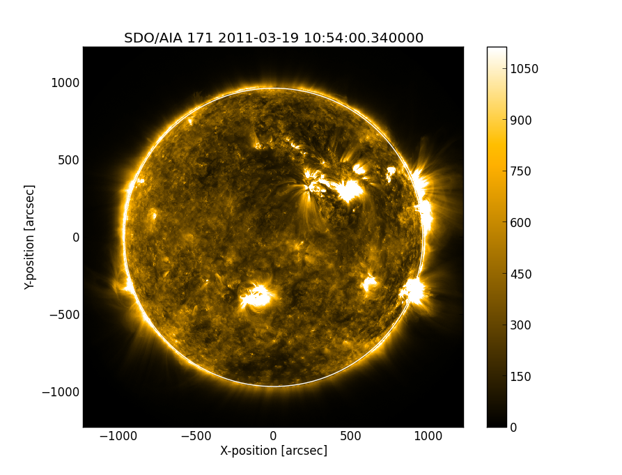

---------------------
A brief tour of SunPy
---------------------

Welcome to the SunPy tutorial! This brief tutorial will walk you through some 
of the functionality currently offered by SunPy. Start by reading this tutorial
and trying out some of the examples demonstrated. Once you've completed the
tutorial check out the :doc:`api reference</sunpy/api/index>` for a more
thorough look at the functionality available.

1. Maps
-------
Maps are the primary data type in SunPy they are spatially and / or temporally aware 
data arrays. There are types of maps for a 2D image, a time series of 2D images or 
1D spectra or 2D spectrograms. Making a map of your data is the normally the first 
step in using SunPy to work with your data. 

**Creating a Map**

SunPy supports many different data products from various sources 'out of the box' we 
shall use SDO's AIA instrument as an example in this tutorial. The general way to create
a map from one of the supported data products is with the `Map()` class from the `map` submodule.

`Map()` takes either a filename, a list of filenames or a data array and header pair. We can test map with::

    import sunpy
    from sunpy.map import Map
    aia = Map(sunpy.AIA_171_IMAGE)

This returns a map named aia which can be manipulated with standard SunPy map commands.
For more information about maps checkout the :doc:`map guide <data_types/maps>`.

2. Plotting
-----------

Let's begin by creating a simple plot of an AIA image. To make things easy,
SunPy includes several example files which are used throughout the docs. These
files have names like `sunpy.AIA_171_IMAGE` and `sunpy.RHESSI_IMAGE`.

Try typing the below example into your interactive Python shell::

    import sunpy
    from sunpy.map import Map
    aia = Map(sunpy.AIA_171_IMAGE)
    aia.peek()

If everything has been configured properly you should see an AIA image with
a red colormap, a colorbar on the right-hand side and a title and some 
labels.

There is lot going on here, but we will walk you through the example. Briefly,
the first line is just importing SunPy. On the second line we create a
SunPy Map object which is basically just a spatially-aware image or data array.
On the last line we then plot the map object, using the built in 'quick plot' function `peek()`.

SunPy uses a matplotlib like interface to it's plotting so more complex plots can be built by combining
SunPy with matplotlib::

    import sunpy
    from sunpy.map import Map
    import matplotlib.pyplot as plt

    aia = Map(sunpy.AIA_171_IMAGE)
    
    fig = plt.figure()
    ax = plt.subplot(111)

    aia.plot()
    plt.colorbar()
    aia.draw_limb()

    plt.show()

This should output something like the image below:

3. Solar Physical Constants
---------------------------

SunPy contains a convenient list of solar-related physical constants. Here is 
a short bit of code to get you started: ::
    
    from sunpy.sun import constants as con

    # one astronomical unit (the average distance between the Sun and Earth)
    print(con.au)

    # the solar radius
    print(con.radius)

Not all constants have a shortcut assigned to them (as above). The rest of the constants 
are stored in a dictionary. The following code grabs the dictionary and gets all of the
keys.::

    solar_constants = con.physical_constants
    solar_constants.keys()
    
You can also use the following function to print out a table of all of the values
available. ::

    con.print_all()

These constants are provided as a convenience so that everyone is using the same 
(accepted values). More will be added over time.

4. Spectra
----------

SunPy has spectral support for instruments which have such a capacity. CALLISTO, 
an international network of Solar Radio Spectrometers, is a specfic example.
The main class used for this is :py:class:CallistoSpectrogram.
Below is the example built into sunpy::
    
    from matplotlib import pyplot as plt
    import sunpy

    from sunpy.spectra.sources.callisto import CallistoSpectrogram
    image = CallistoSpectrogram.read(sunpy.CALLISTO_IMAGE)
    
    image.peek()        

.. image:: ../images/spectra_ex1.png

5. Lightcurves
--------------

SunPy handles time series data, fundamental to the study of any real world phenomenon,
by creating a lightcurve object. Currently lightcurve supports

- SDO/EVE
- GOES XRS
- PROBA2/LYRA

A lightcurve consits of two parts; times and measurements taken at those times. The 
data can either be in your current Python session, alternatively within a local or 
remote file. Let's create some fake data and pass it into a lightcurve object::

    from sunpy.lightcurve import LightCurve
    light_curve = LightCurve.create({"param1": range(24*60)})

Within LightCurve.create, we have a dictionary that contains a single entry with key
"param1" containing a list of 1440 entries (0-1439). As there are no times provided,
so a default set of times are generated.

6. Working with Times
---------------------

SunPy also contains a number of convenience functions for working with dates
and times. Here is a short example: ::

    from sunpy.time import *
    
    # parsing a standard time strings
    parse_time('2004/02/05 12:00')
    
    # This returns a datetime object. All SunPy functions which require 
    # time as an input sanitize the input using parse_time.
    day_of_year('2004-Jul-05 12:00:02')
    
    # the julian day
    julian_day((2010,4,30))
    
    # TimeRange objects are useful for representing ranges of time
    time_range = TimeRange('2010/03/04 00:10', '2010/03/04 00:20')
    time_range.center()

For more information about working with time in SunPy checkout the :doc:`time guide <time>`.

7. Querying the VSO
-------------------
There are a couple different ways to query and download data from the VSO using
SunPy. The method you should use depends first on your preference with respect
to query style: the main method of querying uses a syntax that is unique to
SunPy and may require some getting used to, but is extremely flexible and
powerful. To make it easy for people coming from SSW to get started, a second
"legacy" API also exists which works is very much the same way as VSO_GET in
IDL.

Further, for each of the two query APIs there are interactive and
non-interactive versions available, depending on the type of work you are doing.

The below example demonstrates a simple query for SOHO EIT data using the
non-interactive version of the main API::

    from sunpy.net import vso
    
    # create a new VSOClient instance
    client = vso.VSOClient()
    
    # build our query
    result = client.query(
        vso.attrs.Time((2011, 9, 20, 1), (2011, 9, 20, 2)),
        vso.attrs.Instrument('eit')
    )
    
    # print the number of matches
    print("Number of records found: %d " % result.num_records())
   
    # download matches to /download/path
    res = client.get(result, path="/download/path/{file}").wait()

Note that specifying a path is optional and if you do not specify one the files
will simply be downloaded into a temporary directory (e.g. /tmp/xyz).
For more information about vso client checkout the :doc:`vso guide <acquiring_data/vso>`.

8. Querying Helioviewer.org
---------------------------

SunPy can be used to make several basic requests using the The `Helioviewer.org API <http://helioviewer.org/api/>`__
including generating a PNG and downloading a `JPEG 2000 <http://wiki.helioviewer.org/wiki/JPEG_2000>`__
image and loading it into a SunPy Map.

A simple example of a helioviewer quiery is::

    from sunpy.net.helioviewer import HelioviewerClient
    
    hv = HelioviewerClient()
    hv.download_png('2099/01/01', 4.8, "[SDO,AIA,AIA,304,1,100]", x0=0, y0=0, width=512, height=512)

This downloads a PNG image of the latest AIA 304 image available on 
Helioviewer.org in the `download_png` command 4.8 refers to the image resolution 
in arcseconds per pixel (larger values mean lower resolution), the "1" and "100" in the 
layer string refer to the visibility (visible/hidden) and opacity, 
x0 and y0 are the center points about which to focus and the width and height 
are the pixel values for the image dimensions.

The result is:

.. image:: ../images/helioviewer_download_png_ex1.png

For more information checkout the :doc:`helioviewer guide <acquiring_data/helioviewer>`.

9. Database Package
-------------------

The database package offers the possibility to save retrieved data (e.g. via the
:mod:'sunpy.net.vso' package)onto a local or remote database. The database may be 
a single file located on a local hard drive (if a SQLite database is used) or a 
local or remote database server.
This makes it possible to fetch required data from the local database instead 
of downloading it again from a remote server.

Querying a database is straight forward, as this example using VSO. This example demonstrates
the useful feature which prevents storing the same data twice::

    >>> entries = database.fetch(
    ...     vso.attrs.Time('2012-08-05', '2012-08-05 00:00:05'),
    ...     vso.attrs.Instrument('AIA'))
    >>> entries is None
    False
    >>> len(entries)
    2
    >>> len(database)
    27

    >>> entries = database.fetch(
    ...     vso.attrs.Time('2013-08-05', '2013-08-05 00:00:05'),
    ...     vso.attrs.Instrument('AIA'))
    >>> entries is None
    True
    >>> len(database)
    29

Note the first call has been run before successfully, hence, the False statement. Whereas 
the second call has not been run before and so more elements are added to the database.  
