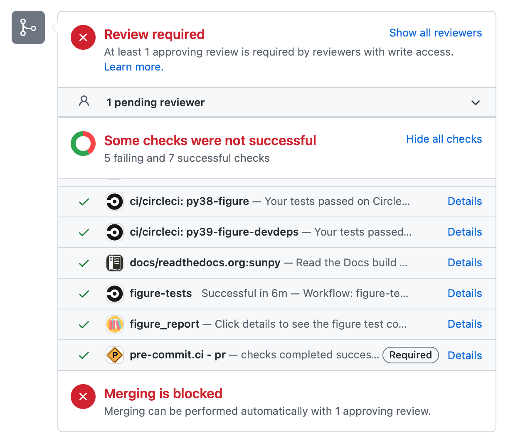
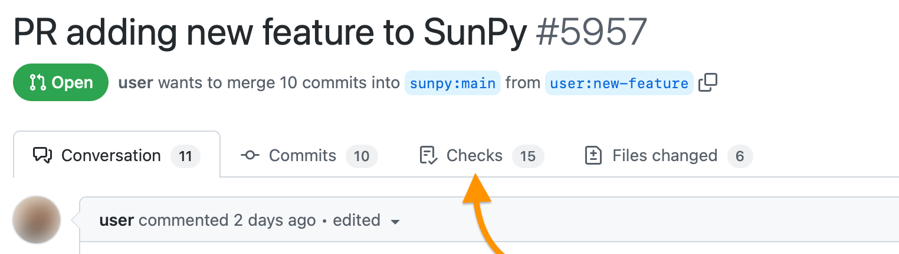
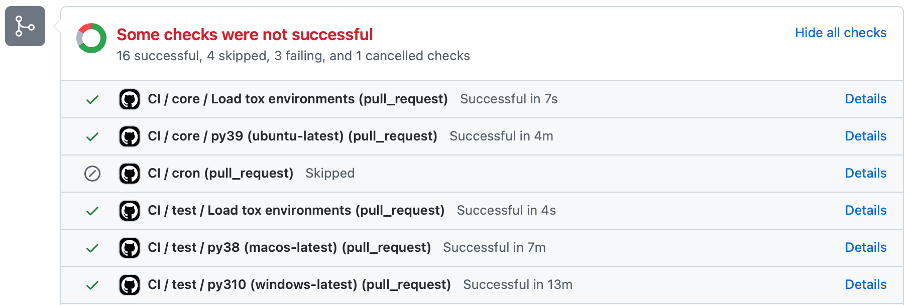
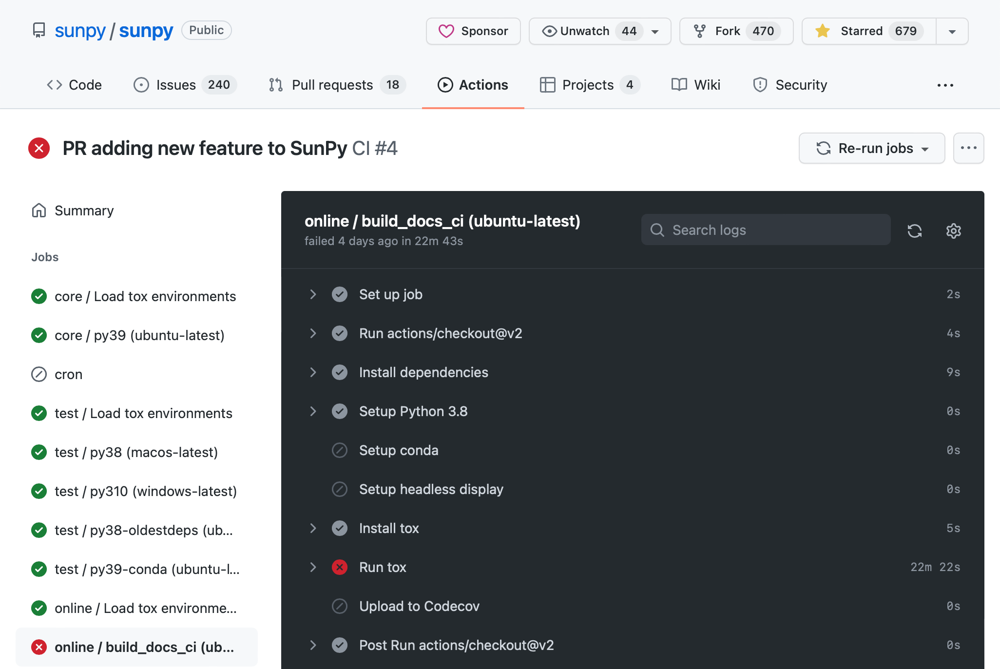

.. _pr_review:

******************************
Pull Requests and GitHub Teams
******************************

This document describes the standards required for a pull request to sunpy and an explanation of our automated tests.

Each pull request **must** meet the following criteria before it is considered for merge:

* The code must be PEP 8 compliant and meet the ill-defined sunpy quality standards.
  We have these in the :ref:`coding-standards` page.

* The PR must contain a changelog entry if it changes the behavior of any code.

* The test coverage should not decrease, and for new features should be at or very close to 100%.

* All code must be properly documented.
  Each function and each class must have an associated documentation string in the correct format.

Review Process
==============

Before the "merge" button is clicked the following criteria must be met:

* All the continuous integration must pass unless there is a known issue.

* At least two members (excluding the PR author) of the "sunpy-developers" group must have approved the PR.
  Exceptions can be made for minor changes, see below.

* All comments posted on the thread must be resolved.

It is important that approval for merging the PR is always done by explicitly approving the PR through the GitHub UI before merging, so a record of approval is left in the PR thread.

Minor changes
-------------

If a PR only makes minor changes, it can be merged by the first reviewer, if they are confident they fully understand the changes.
If this happens, the ``minor-change`` label should be added to the PR to indicate that it has been considered minor enough to need only one reviewer.
The PR author can add this label as a suggestion, but the first reviewer can remove the label as part of their evaluation.

Exactly what constitutes a minor-change is left up to the the reviewer but some examples might include:
- Improvements to existing documentation
- Small bugfixes
- Changes in code style rather than substance

As a guideline, minor-changes don't include:

- New features
- New documentation pages
- Changes to the public facing API

Continuous Integration
======================

Currently we have a variety of services that respond or activate on an opened pull request.

Comments from bots:

* `pep8speaks <https://github.com/OrkoHunter/pep8speaks>`_: Performs a PEP8 check on any submitted code. This is updated as the code changes.

Checks that appear at the bottom of a pull request:

or at the top under the "Checks" tab:

* `figure-tests (CircleCi) <https://circleci.com/gh/sunpy/sunpy/>`_: Runs two figure tests environments ("ci/circleci: py3\_-figure", "ci/circleci: py3\_-figure-devdeps").

* figure_report (Giles): Show the final results and download updated hashes of the figure tests.

* figure_report_devdeps (Giles): Show the final results and download updated hashes of the figure tests using development packages.

* changelog: absent | found (Giles): If a changelog is needed, this will check and will pass if a changelog with the correct number is found.

* `docs/readthedocs.org:sunpy (Read the Docs) <https://readthedocs.org/projects/sunpy/>`_: This builds our documentation.
  This primary check is to ensure the documentation has rendered correctly.
  Warnings are not checked on this build but under GitHub Actions (see below).

* `CI (GitHub Actions) <https://github.com/sunpy/sunpy/actions>`_: Runs our test suite on multiple operating systems.
  If the minimal "CI / core" tests are successful, the indepth "CI / test", documentation "CI / docs" test and remote data "CI / online" tests will be run.
  You will see multiple jobs within each group.
  Each job corresponds to a tox environment being run on a particular operating system.

* `codecov/patch (CodeCov) <https://codecov.io/gh/sunpy/sunpy/>`_: Checks how many lines of the code lack test coverage for the submitted code in the pull request.

* `codecov/project (CodeCov) <https://codecov.io/gh/sunpy/sunpy/>`_: Checks how many lines of the code lack test coverage in sunpy overall.

* `pre-commit.ci - pr <https://pre-commit.ci>`__: Checks the code style checks have passed. This CI will automatically fix style issues by commenting ``pre-commit.ci autofix`` on its own line in a comment on the PR.

It is common to see some of these checks fail.
This can be happen due to a change that has broken a test (should be fixed) or a remote server has failed (might have to wait for it to come back).
Therefore it is important to check why a task failed and if has a pre-existing issue, it can be safe to ignore a failing check on that pull request.
However, you should try to ensure that as many checks pass before merging.

Understanding GitHub Actions
----------------------------

The vast majority of our tests are run on GitHub Actions and this means you might have to navigate to the results if you want to check why the tests failed.
The tests for GitHub Actions are split into multiple phases to reduce the number of builds running at one time.
If your PR fails the minimal initial stage, the subsequent stages tests will not run.

The Azure checks on GitHub manifest:

This is the main form. There will be one check per GitHub Actions job ran.
The publish and notify jobs are skipped in PRs, and each stage has an additional "Load tox environments" job to configure set up the stage.
The "Details" link will show you the log output of the particular check:

On the left you should see the entire list of GitHub Actions checks.
You can navigate between the jobs here.
You can also see a flow diagram for the jobs by clicking on "Summary".

For each of the jobs you can see each step that is undertaken.
Normally the "Run tox" step will be red if the tests have failed.
You will need to click on this so it will load the output from the test suite.

Our test suite is very verbose, so there will be a lot of text outputted.
The important bits of information should be at the bottom as "pytest" prints out a test summary at the end.
For example:

.. code:: bash

    ============================================================================= short test summary info =============================================================================
    SKIPPED [1] d:\a\1\s\.tox\py37\lib\site-packages\pytest_doctestplus\plugin.py:178: unable to import module local('d:\\a\\1\\s\\.tox\\py37\\lib\\site-packages\\sunpy\\io\\setup_package.py')
    SKIPPED [213] d:\a\1\s\.tox\py37\lib\site-packages\pytest_remotedata\plugin.py:87: need --remote-data option to run
    SKIPPED [18] d:\a\1\s\.tox\py37\lib\site-packages\_pytest\doctest.py:387: all tests skipped by +SKIP option
    SKIPPED [1] .tox\py37\lib\site-packages\sunpy\map\sources\tests\test_source_type.py:21: Glymur can not be imported.
    SKIPPED [1] .tox\py37\lib\site-packages\sunpy\map\sources\tests\test_source_type.py:30: Glymur can not be imported.
    SKIPPED [1] .tox\py37\lib\site-packages\sunpy\io\tests\test_ana.py:22: ANA is not available.
    SKIPPED [1] .tox\py37\lib\site-packages\sunpy\io\tests\test_ana.py:31: ANA is not available.
    SKIPPED [1] .tox\py37\lib\site-packages\sunpy\io\tests\test_ana.py:40: ANA is not available.
    SKIPPED [1] .tox\py37\lib\site-packages\sunpy\io\tests\test_ana.py:49: ANA is not available.
    SKIPPED [1] .tox\py37\lib\site-packages\sunpy\io\tests\test_ana.py:58: ANA is not available.
    SKIPPED [1] .tox\py37\lib\site-packages\sunpy\io\tests\test_ana.py:67: ANA is not available.
    SKIPPED [1] .tox\py37\lib\site-packages\sunpy\io\tests\test_filetools.py:54: Glymur can not be imported.
    SKIPPED [1] .tox\py37\lib\site-packages\sunpy\io\tests\test_filetools.py:73: Glymur can not be imported.
    SKIPPED [1] .tox\py37\lib\site-packages\sunpy\io\tests\test_filetools.py:106: ANA is not available.
    SKIPPED [1] .tox\py37\lib\site-packages\sunpy\io\tests\test_filetools.py:115: ANA is not available.
    SKIPPED [1] .tox\py37\lib\site-packages\sunpy\io\tests\test_filetools.py:122: ANA is not available.
    SKIPPED [1] .tox\py37\lib\site-packages\sunpy\io\tests\test_jp2.py:11: Glymur can not be imported.
    SKIPPED [1] .tox\py37\lib\site-packages\sunpy\io\tests\test_jp2.py:21: Glymur can not be imported.
    SKIPPED [1] .tox\py37\lib\site-packages\sunpy\io\tests\test_jp2.py:31: Glymur can not be imported.
    SKIPPED [1] .tox\py37\lib\site-packages\sunpy\net\tests\test_fido.py:298: Windows.
    FAILED ..\..\.tox\py37\lib\site-packages\sunpy\timeseries\sources\noaa.py::sunpy.timeseries.sources.noaa.NOAAGoesSXRTimeSeries

If you want to find the full test output, you can search the tab for the name of the test out of the ~3 results, one will be that output.

SunPy GitHub Groups
===================

This document has already referred to two SunPy groups, namely "developers" and "maintainers" there is also a third primary SunPy group "owners".

SunPy owners
------------

The SunPy owners group is the group of people who have total control over the SunPy GitHub organization.
The SunPy board have control over who is in this group, it has been decided that generally it will be the Lead Developer and the SunPy board chair and vice-chair.

sunpy Maintainers
-----------------

This is the group of people who have push access to the main sunpy repository.
The membership of this group is at the discretion of the Lead Developer, but shall generally be made up of people who have demonstrated themselves to be trust worthy and active contributors to the project.

This group has `subgroups <https://github.com/orgs/sunpy/teams/sunpy-maintainers/teams>`__ for each section of the repository that has `maintainers <https://sunpy.org/project/#maintainers>`__.
The members of these groups will automatically be requested to review all PRs which change files in that subpackage.

sunpy Developers
----------------

The members of this group have "read" access to the sunpy repository.
As all these repository are open anyway, what this effectively means is that these people can be assigned to issues.
The members of this group are people who are involved in the development of sunpy at a good frequency, they are people who's opinions have been demonstrated to be constructive and informative.
