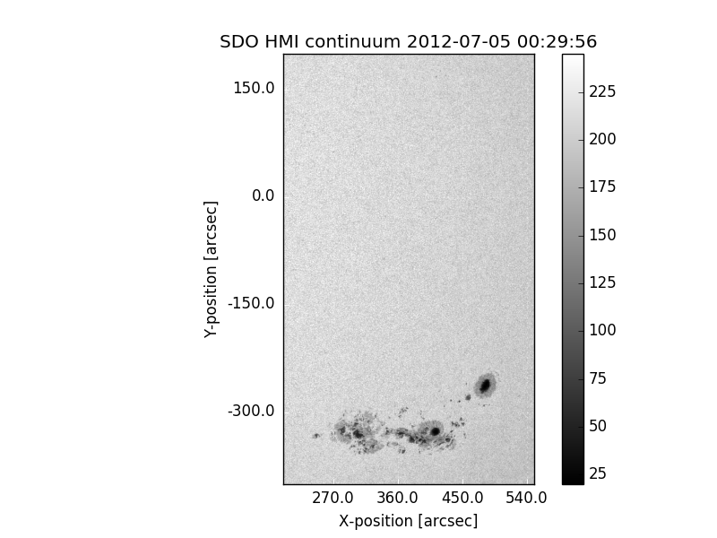
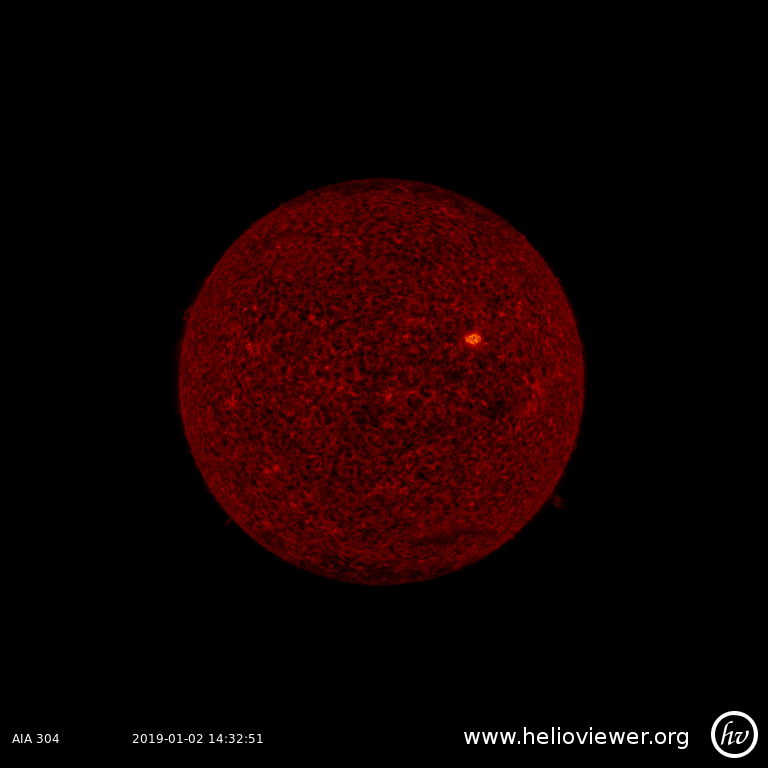
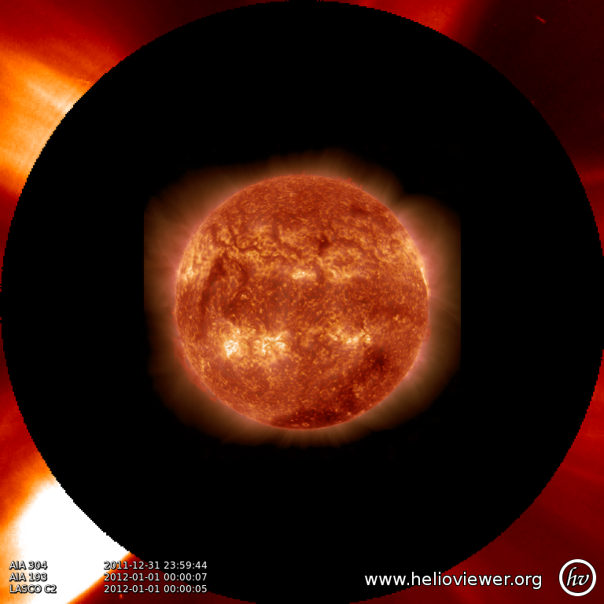

***********************************
Querying Helioviewer.org with SunPy
***********************************

SunPy can be used to make several basic requests using the The `Helioviewer.org API <https://api.helioviewer.org/docs/v2/>`_ including generating a PNG screenshot and downloading a `JPEG 2000 <https://wiki.helioviewer.org/wiki/JPEG_2000>`_ image.

As you can get JPEG 2000 images, you will need two other pieces of software in order to open them in Python.
The first is OpenJPEG which is an open source library for reading and writing JPEG2000 files.
The other package you will need is `Glymur <https://pypi.python.org/pypi/Glymur/>`_.
Both of these are available as `conda <https://www.anaconda.com/>`_ packages and ideally should be installed in this manner.
Otherwise, please follow the instructions at `the OpenJPEG homepage <http://www.openjpeg.org>`_ and the `Glymur homepage <https://glymur.readthedocs.io/en/latest/>`_.

To interact with the Helioviewer API, users first create a `~sunpy.net.helioviewer.HelioviewerClient` instance.
The client instance can then be used to make various queries against the API using the same parameters one would use when making a web request.
Note that the HelioviewerClient does not currently offer full access to the HelioViewer API.

We provide the follwing functions:

1. Download a JPEG 2000 image for the specified datasource that is the closest match in time to the ``date`` requested.
2. As above but return the full JSON response instead of an image.
3. Return all available datasources.
4. Generates custom screenshots that allow labels and layers of images.
5. Download the header information present in a JPEG2000 image. This includes:
    - FITS header
    - Helioviewer-specific metadata.

Nearly all requests require the user to specify the data they are interested in.
Depending on the function, it consists of passing in either: *observatory*, *instrument*,
*detector* and *measurement* or *source_id* keywords.

To find out what the allowed values are, you can access the `~sunpy.net.helioviewer.HelioviewerClient.data_sources` dictionary that is an attribute of the Helioviewer client.
Let us begin by retrieving the available list of sources that Helioviewer supports by using `~sunpy.net.helioviewer.HelioviewerClient.data_sources`::

    >>> from sunpy.net import helioviewer
    >>> hv = helioviewer.HelioviewerClient()  # doctest: +REMOTE_DATA
    >>> for sourceid, obs in hv.data_sources.items():# doctest: +REMOTE_DATA
    ...     print(f"{sourceid}: {obs}")  # doctest: +REMOTE_DATA
    ('SOHO', 'EIT', None, '171'): 0
    ('SOHO', 'EIT', None, '195'): 1
    ('SOHO', 'EIT', None, '284'): 2
    ('SOHO', 'EIT', None, '304'): 3
    ('SOHO', 'LASCO', 'C2', 'white-light'): 4
    ('SOHO', 'LASCO', 'C3', 'white-light'): 5
    ('SOHO', 'MDI', None, 'magnetogram'): 6
    ('SOHO', 'MDI', None, 'continuum'): 7
    ('SDO', 'AIA', None, '94'): 8
    ('SDO', 'AIA', None, '131'): 9
    ('SDO', 'AIA', None, '171'): 10
    ('SDO', 'AIA', None, '193'): 11
    ('SDO', 'AIA', None, '211'): 12
    ('SDO', 'AIA', None, '304'): 13
    ('SDO', 'AIA', None, '335'): 14
    ('SDO', 'AIA', None, '1600'): 15
    ('SDO', 'AIA', None, '1700'): 16
    ('SDO', 'AIA', None, '4500'): 17
    ('SDO', 'HMI', None, 'continuum'): 18
    ('SDO', 'HMI', None, 'magnetogram'): 19
    ('STEREO_A', 'SECCHI', 'EUVI', '171'): 20
    ('STEREO_A', 'SECCHI', 'EUVI', '195'): 21
    ('STEREO_A', 'SECCHI', 'EUVI', '284'): 22
    ('STEREO_A', 'SECCHI', 'EUVI', '304'): 23
    ('STEREO_B', 'SECCHI', 'EUVI', '171'): 24
    ('STEREO_B', 'SECCHI', 'EUVI', '195'): 25
    ('STEREO_B', 'SECCHI', 'EUVI', '284'): 26
    ('STEREO_B', 'SECCHI', 'EUVI', '304'): 27
    ('STEREO_A', 'SECCHI', 'COR1', 'white-light'): 28
    ('STEREO_A', 'SECCHI', 'COR2', 'white-light'): 29
    ('STEREO_B', 'SECCHI', 'COR1', 'white-light'): 30
    ('STEREO_B', 'SECCHI', 'COR2', 'white-light'): 31
    ('PROBA2', 'SWAP', None, '174'): 32
    ('Yohkoh', 'SXT', None, 'AlMgMn'): 33
    ('Yohkoh', 'SXT', None, 'thin-Al'): 34
    ('Yohkoh', 'SXT', None, 'white-light'): 35
    ('Hinode', 'XRT', 'Al_med', 'Al_thick'): 39
    ('Hinode', 'XRT', 'Al_med', 'Be_thick'): 40
    ('Hinode', 'XRT', 'Al_med', 'Open'): 42
    ('Hinode', 'XRT', 'Al_med', 'Ti_poly'): 43
    ('Hinode', 'XRT', 'Al_poly', 'Al_mesh'): 44
    ('Hinode', 'XRT', 'Al_poly', 'Al_thick'): 45
    ('Hinode', 'XRT', 'Al_poly', 'Be_thick'): 46
    ('Hinode', 'XRT', 'Al_poly', 'Open'): 48
    ('Hinode', 'XRT', 'Al_poly', 'Ti_poly'): 49
    ('Hinode', 'XRT', 'Be_med', 'Open'): 54
    ('Hinode', 'XRT', 'Be_thin', 'Open'): 60
    ('Hinode', 'XRT', 'C_poly', 'Al_mesh'): 62
    ('Hinode', 'XRT', 'C_poly', 'Al_thick'): 63
    ('Hinode', 'XRT', 'C_poly', 'Open'): 66
    ('Hinode', 'XRT', 'C_poly', 'Ti_poly'): 67
    ('Hinode', 'XRT', 'Open', 'Al_mesh'): 69
    ('Hinode', 'XRT', 'Open', 'Al_thick'): 70
    ('Hinode', 'XRT', 'Open', 'Be_thick'): 71
    ('Hinode', 'XRT', 'Open', 'Ti_poly'): 74
    ('TRACE', None, None, '171'): 75
    ('TRACE', None, None, '195'): 76
    ('TRACE', None, None, '284'): 77
    ('TRACE', None, None, '1216'): 78
    ('TRACE', None, None, '1550'): 79
    ('TRACE', None, None, '1600'): 80
    ('TRACE', None, None, '1700'): 81
    ('TRACE', None, None, 'white-light'): 82
    ('MLSO', 'COSMO', 'KCor', '735'): 83
    ('Hinode', 'XRT', 'Any', 'Any'): 10001
    ('Hinode', 'XRT', 'Any', 'Al_mesh'): 10002
    ('Hinode', 'XRT', 'Any', 'Al_thick'): 10003
    ('Hinode', 'XRT', 'Any', 'Be_thick'): 10004
    ('Hinode', 'XRT', 'Any', 'Gband'): 10005
    ('Hinode', 'XRT', 'Any', 'Open'): 10006
    ('Hinode', 'XRT', 'Any', 'Ti_poly'): 10007
    ('Hinode', 'XRT', 'Al_med', 'Any'): 10008
    ('Hinode', 'XRT', 'Al_poly', 'Any'): 10009
    ('Hinode', 'XRT', 'Be_med', 'Any'): 10010
    ('Hinode', 'XRT', 'Be_thin', 'Any'): 10011
    ('Hinode', 'XRT', 'C_poly', 'Any'): 10012
    ('Hinode', 'XRT', 'Open', 'Any'): 10013

Every JPEG 2000 file provided by the Helioviewer Project has been processed to generate an image that
can be used for browsing purposes.
This typically involves following the standard image processing procedure used by each instrument team to convert their science data into an image for a webpage.
The JPEG 2000 image is then scaled between 0 and 255 (byte-scaled).
**Please note that the JPEG 2000 image data is not the same as the original science data.**

Suppose we want to download a JPEG 2000 image of the latest AIA 304 image available on Helioviewer.org.
From the list above, we know that SDO/AIA 304  is ``(('SDO', 'AIA', None, '304'), 13)``.
So ``observatory="SDO"``,``instrument=AIA``, ``detector=None``, ``measurement=304`` and the ``source_id`` is 13.
So we can use the approach as shown in the following example::

   >>> from sunpy.net.helioviewer import HelioviewerClient
   >>> import matplotlib.pyplot as plt
   >>> hv = HelioviewerClient()  # doctest: +REMOTE_DATA
   >>> file = hv.download_jp2('2012/01/01', observatory="SDO", instrument="AIA",
   ...                        measurement="304")  # doctest: +REMOTE_DATA

Since ``detector=None`` we can ignore this keyword and skip it when we call this function.
As we also have the source_id for AIA 304, which is ``13``, we could make the same request using: ::

   file = hv.download_jp2('2012/01/01', source_id=13)

Since this is a JPEG 2000 image, to plot this image you can either call Glymur directly::

   >>> import glymur # doctest: +SKIP
   >>> im = glymur.Jp2k(file)[:]  # doctest: +SKIP

The better method is to load the image into a SunPy Map object::

   >>> from sunpy.map import Map
   >>> aia = Map(file)  # doctest: +SKIP
   >>> aia.peek()  # doctest: +SKIP

.. image:: helioviewer-1.png

The SunPy Map selects a color table based on the JPEG 2000 image meta data for plotting.
This will be the color table that is used by the Helioviewer Project to display JPEG 2000 images in their own clients.

In this example we will query Helioviewer for the relevant JPEG 2000 file closest to the input time, for a SDO/HMI continuum image and crop to focus on an active region::

   >>> from sunpy.net.helioviewer import HelioviewerClient
   >>> import matplotlib.pyplot as plt
   >>> from astropy.units import Quantity
   >>> from sunpy.map import Map
   >>> hv = HelioviewerClient()  # doctest: +REMOTE_DATA
   >>> data_sources = hv.get_data_sources()  # doctest: +REMOTE_DATA
   >>> filepath = hv.download_jp2('2012/07/05 00:30:00', observatory='SDO',
   ...                            instrument='HMI', measurement='continuum')  # doctest: +REMOTE_DATA
   >>> hmi = Map(filepath)  # doctest: +SKIP
   >>> xrange = Quantity([200, 550], 'arcsec')  # doctest: +REMOTE_DATA
   >>> yrange = Quantity([-400, 200], 'arcsec')  # doctest: +REMOTE_DATA
   >>> hmi.submap(xrange, yrange).peek()  # doctest: +SKIP

The other main method is `~sunpy.net.helioviewer.HelioviewerClient.download_png`.
This allows more complex images to be created but again these are not the original science data.
The biggest difference is that we do not use the separate keywords but have to pass them as a string of lists.
This is the ``layer`` keyword in this function.

We will recreate the first example using the PNG function::

   >>> from sunpy.net.helioviewer import HelioviewerClient
   >>> import matplotlib.pyplot as plt
   >>> from matplotlib.image import imread
   >>> hv = HelioviewerClient()  # doctest: +REMOTE_DATA
   >>> file = hv.download_png('2020/01/01', 4.8, "[SDO,AIA,304,1,100]", x0=0, y0=0, width=768, height=768, watermark=True)  # doctest: +REMOTE_DATA
   >>> im = imread(file)  # doctest: +REMOTE_DATA
   >>> plt.imshow(im)  # doctest: +SKIP
   >>> plt.axis('off')  # doctest: +SKIP
   >>> plt.show()  # doctest: +SKIP

Since this is just a PNG, we can use matplotlib directly to plot this image.
Note that the filename of the returned file has the date and time of the request, not of any of the times shown in the image itself.
**This is not a bug.**
The reason for this is that the user may ask for images from multiple sources, and each of them may have a different observation time.
The problem becomes which time is the most appropriate to associate with the resultant image.
Helioviewer.org doesn't choose between the images times, but instead uses the request time to construct the image filename.
This means that the image file names for request times in the future (like in this example) can look a little unusual compared to the times in the image.

After the date string, we have a number (``4.8``) which refers to the image resolution in arcseconds per pixel (larger values mean lower resolution).
The next input is the ``layers`` keyword which is ``"[SDO,AIA,304,1,100]"``.
The first 4 are the observatory, instrument, detector, measurement values from before.
Note that since SDO AIA has no detector value, you can skip this within the list.
The ``1`` and ``100`` in the layer list refer to the visibility and opacity of the datasource.
You can use the ``sourceid`` instead of the keywords, so it would be ``[13,1,100]`` for this example.

Finally, the ``x0`` and ``y0`` are the center points about which to focus and the ``width`` and ``height`` are the pixel values for the image dimensions.
These have defaults set so you do not need to supply these.

In this example we will create a composite PNG image using data from two different SDO AIA wavelengths and LASCO C2 coronagraph data.
The layer string is extended to include the additional data sources, and opacity is throttled down for the second AIA layer so that it does not completely block out the lower layer::

   >>> from sunpy.net.helioviewer import HelioviewerClient
   >>> import matplotlib.pyplot as plt
   >>> from matplotlib.image import imread
   >>> hv = HelioviewerClient()  # doctest: +REMOTE_DATA
   >>> file = hv.download_png('2012/01/01', 6,
   ...                        "[SDO,AIA,304,1,100],[SDO,AIA,193,1,50],[SOHO,LASCO,C2,white-light,1,100]",
   ...                        x0=0, y0=0, width=768, height=768, watermark=True)  # doctest: +REMOTE_DATA
   >>> im = imread(file)  # doctest: +REMOTE_DATA
   >>> plt.imshow(im)  # doctest: +SKIP
   >>> plt.axis('off')  # doctest: +SKIP
   >>> plt.show()  # doctest: +SKIP

For more information about using querying Helioviewer.org, see the `Helioviewer.org
API documentation <https://api.helioviewer.org/docs/v2/>`_.
