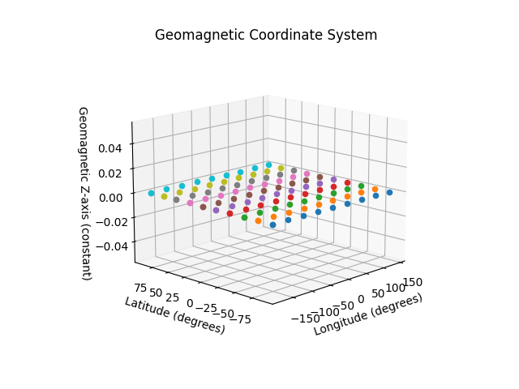

How to Use Magnetic Coordinate Frames
=====================================

The purpose of this Documentation is to demonstrate how to use

- **Geomagnetic**
- **SolarMagnetic**
- **GeocentricSolarMagnetospheric (GSM)**

frames in SunPy.  
This will enable accurate positioning and calculations for solar physics, space weather, and magnetosphere studies.

Now Let's Understand Them One by One
====================================

Geomagnetic
************

.. code-block:: python

    import sunpy.coordinates as coord
    import astropy.units as u

    # Define coordinates in Geomagnetic frame (Longitude = 45°, Latitude = 45°)
    mag_coord = coord.Geomagnetic(lon=45*u.deg, lat=45*u.deg)

    # Print the coordinate
    print("Geomagnetic Coordinate:", mag_coord)

Output:
-------

.. code-block::

    Geomagnetic Coordinate: <Geomagnetic Coordinate (obstime=None, magnetic_model=igrf13): (lon, lat) in deg
        (45., 45.)>

Use Case:
To define a point in Earth's magnetic coordinate system (Magnetic North Pole) based on latitude and longitude.

SolarMagnetic
**************

.. code-block:: python

    import sunpy.coordinates as coord
    import astropy.units as u

    # Define coordinates in SolarMagnetic frame (Longitude = 45°, Latitude = 45°)
    sol_mag_coord = coord.SolarMagnetic(lon=45*u.deg, lat=45*u.deg)

    # Print the coordinate
    print("SolarMagnetic Coordinate:", sol_mag_coord)

Output:
-------

.. code-block::

    SolarMagnetic Coordinate: <SolarMagnetic Coordinate (obstime=None, magnetic_model=igrf13): (lon, lat) in deg
        (45., 45.)>

Use Case:
To define a point in the Solar Magnetic coordinate system based on latitude and longitude relative to the Sun.

GeocentricSolarMagnetospheric (GSM)
***********************************

.. code-block:: python

    import sunpy.coordinates as coord
    import astropy.units as u

    # Define coordinates in GeocentricSolarMagnetospheric frame (Longitude = 45°, Latitude = 45°)
    gsm_coord = coord.GeocentricSolarMagnetospheric(lon=45*u.deg, lat=45*u.deg)

    # Print the coordinate
    print("GeocentricSolarMagnetospheric Coordinate:", gsm_coord)

Output:
-------

.. code-block::

    GeocentricSolarMagnetospheric Coordinate: <GeocentricSolarMagnetospheric Coordinate (obstime=None, magnetic_model=igrf13): (lon, lat) in deg
        (45., 45.)>

Use Case:
To define a point in the Geocentric Solar Magnetospheric coordinate system based on latitude and longitude relative to Earth and the Sun.

Summary
=======

- **Geomagnetic**: Used to model Earth's magnetic field.
- **SolarMagnetic**: Used to model the Sun's magnetic field.
- **GeocentricSolarMagnetospheric (GSM)**: Used to model the Earth's magnetosphere in relation to solar wind.

Practical Implications
======================

In this example, we will calculate the separation between two points in the Geomagnetic frame using latitude and longitude.

.. code-block:: python

    import sunpy.coordinates as coord
    import astropy.units as u
    import numpy as np

    # Define two Geomagnetic coordinates (Longitude and Latitude)
    coord1 = coord.Geomagnetic(lon=45*u.deg, lat=45*u.deg)
    coord2 = coord.Geomagnetic(lon=50*u.deg, lat=50*u.deg)

    # Calculate separation (basic formula for distance between lat, lon coordinates)
    # In real-world applications, more complex formulas and considerations are used.
    lat_diff = coord2.lat - coord1.lat
    lon_diff = coord2.lon - coord1.lon

    # Use Pythagoras' theorem (assuming spherical Earth for simplicity)
    distance = np.sqrt(lat_diff**2 + lon_diff**2)

    print(f"Distance between points in Geomagnetic frame: {distance}")

Output:
-------

.. code-block::

    Distance between points in Geomagnetic frame: 7.0710678118654755

Use Case:
**Geomagnetic**: Used for calculating distance between two points on Earth based on magnetic coordinates (useful for studying the Earth’s magnetic field).

Note:
In real applications, these frames would be used for more complex calculations (e.g., determining the position of solar events, tracking satellite orbits within Earth's magnetosphere, etc.).

Visualizing the Magnetic Coordinates
====================================

To display the visual 3D representation of these coordinates, we can use the following code:

Code for 3D Visualization
-------------------------

.. code-block:: python

    import matplotlib.pyplot as plt
    from mpl_toolkits.mplot3d import Axes3D
    import numpy as np
    import sunpy.coordinates as coord
    from sunpy.coordinates import frames
    from astropy import units as u

    # Create a 3D plot
    fig = plt.figure()
    ax = fig.add_subplot(111, projection='3d')

    # Generate a grid of longitude and latitude
    longitudes = np.linspace(-180, 180, 10)  # 10 points from -180 to 180 degrees
    latitudes = np.linspace(-90, 90, 10)    # 10 points from -90 to 90 degrees

    # Plot points in the Geomagnetic frame
    for lon in longitudes:
        for lat in latitudes:
            mag_coord = coord.Geomagnetic(lon=lon*u.deg, lat=lat*u.deg)
            ax.scatter(mag_coord.lon, mag_coord.lat, 0)  # 3D scatter, setting the z-coordinate to 0

    # Labels and title
    ax.set_xlabel('Longitude (degrees)')
    ax.set_ylabel('Latitude (degrees)')
    ax.set_zlabel('Geomagnetic Z-axis (constant)')
    ax.set_title('Geomagnetic Coordinate System')

    # Show plot
    plt.show()

Final Notes
===========

The three coordinate frames—
**Geomagnetic**, **SolarMagnetic**, and **GeocentricSolarMagnetospheric (GSM)**—are pivotal for solar physics, magnetosphere modeling, and space weather studies. Using them will allow researchers to model and analyze Earth's and the Sun's magnetic fields effectively. 

These frames provide an efficient way to describe and calculate various positions and phenomena within Earth's magnetosphere, Sun's magnetic environment, and the relationship between the two.
