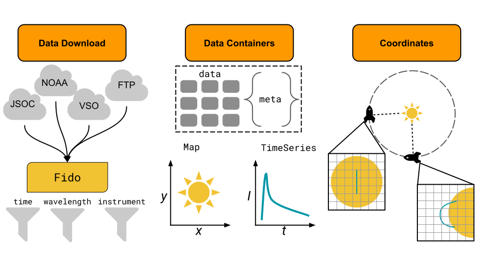

************************
sunpy core Documentation
************************

``sunpy`` is a community-developed, free and open-source solar data analysis environment for Python.
It provides search and download functionality, data containers for image and time series data, as well as commonly used coordinate frames and transformations between such frames.

.. grid:: 1 2 3 3
    :gutter: 2

    .. grid-item-card:: Tutorial
        :link: tutorial
        :link-type: ref
        :text-align: center

        :material-outlined:`accessibility_new;8em`

        **New users start here!** Walkthrough on how to install sunpy and use the key features of the package.

    .. grid-item-card:: How-to Guides
        :link: how_to_guide
        :link-type: ref
        :text-align: center

        :material-outlined:`menu_book;8em`

        Snippets of code for accomplishing specific tasks with sunpy. Most useful for answering "How do I..." questions.

    .. grid-item-card:: Example gallery
        :link: generated/gallery
        :text-align: center

        :material-outlined:`palette;8em`

        Examples including plots on accomplishing common tasks using sunpy.

    .. grid-item-card:: Topic Guides
        :link: guide
        :link-type: ref
        :text-align: center

        :material-outlined:`school;8em`

        In-depth explanations of concepts and key topics. Most useful for answering "why" questions.

    .. grid-item-card:: Reference
        :link: reference
        :link-type: ref
        :text-align: center

        :material-outlined:`code;8em`

        Technical description of the inputs, outputs, and behavior of each component of sunpy.

    .. grid-item-card:: Get Help
        :link: whatsnew
        :link-type: ref
        :text-align: center

        :material-outlined:`support;8em`

        Find out how to join the chat room or post to discourse or GitHub to get help

    .. grid-item-card:: What's New
        :link: whatsnew
        :link-type: ref
        :text-align: center

        :material-outlined:`wb_sunny;8em`

        Find out what's new in sunpy

    .. grid-item-card:: Known Issues
        :link: known_issues
        :link-type: ref
        :text-align: center

        :material-outlined:`wb_sunny;8em`

        View a list of known issues or report new issues on our `GitHub issue tracker`_.

    .. grid-item-card:: Developer's Guide
        :link: dev_guide
        :link-type: ref
        :text-align: center

        :material-outlined:`wb_sunny;8em`

        Read the developer's guide to start contributing to the SunPy project.

.. _GitHub issue tracker: https://github.com/sunpy/sunpy/issues

.. toctree::
    :maxdepth: 1
    :hidden:

    tutorial/index
    tutorial/installation
    generated/gallery/index
    how_to/index
    guide/index
    reference/index
    whatsnew/index
    about
    reference/known_issues
    reference/stability
    dev_guide/index
