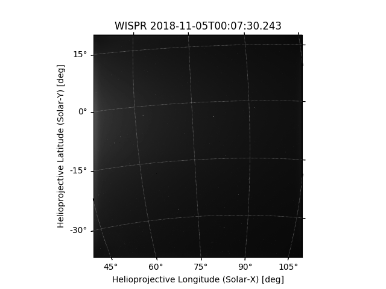

.. doctest-skip-all

.. _whatsnew-1.1:

************************
What's New in SunPy 1.1?
************************

Overview
========

The SunPy project is pleased to announce the 1.1 release of the sunpy package.

The headline changes in 1.1 are:

* The `~sunpy.coordinates` subpackage now supports four additional coordinate frames (HCI, HEE, GSE, and GEI).
* A new subpackage `sunpy.data.data_manager` has been added to support versioned data for functions and methods.
* Support in `sunpy.map` and `sunpy.net` for the SUVI instrument on GOES satellites.
* Initial support for WISPR data from Parker Solar Probe in `sunpy.map`.
* The import times for `sunpy` and some subpackages are significantly shorter, with no loss of functionality.

On this page, you can read about some of the big changes in this release:

* :ref:`whatsnew-1.1-python`
* :ref:`whatsnew-1.1-coordinates`
* :ref:`whatsnew-1.1-dl_manager`
* :ref:`whatsnew-1.1-SUVI`
* :ref:`whatsnew-1.1-WISPR`
* :ref:`whatsnew-1.1-importtime`

SunPy 1.1 also includes a large number of smaller improvements and bug fixes, which are described in the :ref:`changelog`.

By the numbers:

* 1137 commits have been added since 1.0
* 106 issues have been closed since 1.0
* 242 pull requests have been merged since 1.0
* 24 people have contributed since 1.0
* 10 new contributors

.. _whatsnew-1.1-python:

Supported versions of Python
============================

Like SunPy 1.0, 1.1 comes with support for Python versions 3.6, 3.7 and support for 3.8 has been added.

.. _whatsnew-1.1-coordinates:

New coordinate frames
=====================

The `~sunpy.coordinates` subpackage now supports four additional coordinate frames of interest to solar physics:

* `Heliocentric Inertial (HCI) <sunpy.coordinates.frames.HeliocentricInertial>`
* `Heliocentric Earth Ecliptic (HEE) <sunpy.coordinates.frames.HeliocentricEarthEcliptic>`
* `Geocentric Solar Ecliptic (GSE) <sunpy.coordinates.frames.GeocentricSolarEcliptic>`
* `Geocentric Earth Equatorial (GEI) <sunpy.coordinates.frames.GeocentricEarthEquatorial>`

The following transformation graph illustrates how all of these coordinate frames can be transformed to any other frame in `sunpy.coordinates` or `astropy.coordinates`:

.. graphviz::

   digraph {
        ICRS [label=ICRS]
        HCRS [label=HCRS]
        HeliocentricMeanEcliptic [label="Heliocentric Aries Ecliptic (HAE)"]
        HeliographicStonyhurst [label="Heliographic Stonyhurst (HGS)\nHeliocentric Earth Equatorial (HEEQ)"]
        HeliocentricEarthEcliptic [label="Heliocentric Earth Ecliptic (HEE)"]
        GeocentricEarthEquatorial [label="Geocentric Earth Equatorial (GEI)"]
        HeliographicCarrington [label="Heliographic Carrington (HGC)"]
        Heliocentric [label="Heliocentric Cartesian (HCC)"]
        HeliocentricInertial [label="Heliocentric Inertial (HCI)"]
        Helioprojective [label="Helioprojective Cartesian (HPC)"]
        GeocentricSolarEcliptic [label="Geocentric Solar Ecliptic (GSE)"]
        ICRS -> HCRS
        ICRS -> HeliocentricMeanEcliptic
        HCRS -> ICRS
        HCRS -> HeliographicStonyhurst
        HeliocentricMeanEcliptic -> ICRS
        HeliocentricMeanEcliptic -> HeliocentricEarthEcliptic
        HeliocentricMeanEcliptic -> GeocentricEarthEquatorial
        HeliographicStonyhurst -> HeliographicCarrington
        HeliographicStonyhurst -> Heliocentric
        HeliographicStonyhurst -> HCRS
        HeliographicStonyhurst -> HeliocentricInertial
        HeliographicCarrington -> HeliographicStonyhurst
        Heliocentric -> Helioprojective
        Heliocentric -> HeliographicStonyhurst
        Helioprojective -> Heliocentric
        HeliocentricEarthEcliptic -> HeliocentricMeanEcliptic
        HeliocentricEarthEcliptic -> GeocentricSolarEcliptic
        GeocentricSolarEcliptic -> HeliocentricEarthEcliptic
        HeliocentricInertial -> HeliographicStonyhurst
        GeocentricEarthEquatorial -> HeliocentricMeanEcliptic
        subgraph cluster_astropy {
                color=blue
                fontcolor=blue
                penwidth=2
                label=<<b>Frames implemented in Astropy</b>>
                ICRS
                HCRS
                HeliocentricMeanEcliptic
                astropy [label="Other Astropy frames" shape=box3d style=filled]
                geocentric [label="Earth-centered frames\n(including GEO)" shape=box3d style=filled]
                astropy -> ICRS
                geocentric -> ICRS
                ICRS -> astropy
                ICRS -> geocentric
        }
        subgraph cluster_sunpy {
                color=crimson
                fontcolor=crimson
                penwidth=2
                label=<<b>Frames implemented in SunPy</b>>
                Helioprojective
                Heliocentric
                HeliographicStonyhurst
                HeliographicCarrington
                subgraph cluster_sunpy11 {
                        color=chocolate
                        fontcolor=chocolate
                        label=<<b>Added in SunPy 1.1</b>>
                        HeliocentricInertial
                        HeliocentricEarthEcliptic
                        GeocentricSolarEcliptic
                        GeocentricEarthEquatorial
                }
        }
        newrank=true
   }

See our :ref:`coordinates documentation <sunpy-coordinates>` for a table of the currently supported coordinate systems and the corresponding frame classes.

.. _whatsnew-1.1-dl_manager:

Manager for Versioned Data Files
================================

SunPy 1.1 provides a data manager for versioning and caching remote files.
The objective of this is to provide a way for data required for functions, such as instrument correction routines, to depend on non-local data in a reliable way.
The data manager also guarantees that a specific version of the code uses a specific data file, with the ability for users to specify updated files.

This works by providing the URL of a remote file and a SHA256 hash to the `sunpy.data.manager.require <sunpy.data.data_manager.DataManager.require>` decorator which can be added to functions that require these specific data files from remote sources.
If the specified hash does not match that of the remote version, an exception is raised to make the user aware of any changes on the remote server or corruption of local files.
Additionally, `sunpy.data.cache <sunpy.data.data_manager.Cache>` can be used to avoid re-downloading files that already exist on a user's local machine, thus saving disk space and internet bandwidth.

See :ref:`remote_data` for more details.

.. _whatsnew-1.1-SUVI:

Support for SUVI Data
=====================

The Solar Ultraviolet Imager (SUVI) is a EUV instrument imaging the full disk of the Sun in six passbands, and is onboard the latest of the Geostationary Operational Environmental Satellite (GOES) missions.
`~sunpy.map.sources.SUVIMap` provides SunPy map support for loading SUVI FITS image data, and the `~sunpy.net.dataretriever.SUVIClient` adds support to search for SUVI data hosted by NOAA via `Fido <sunpy.net.fido_factory.UnifiedDownloaderFactory>`. It supports searching for wavelength, level of data (level 2 data which consists of stacked level 1b images and original level 1b files), as well as GOES satellite number (>= GOES 16).

.. _whatsnew-1.1-WISPR:

Initial Support for WISPR Images
================================

Following the first data release from Parker Solar Probe, SunPy 1.1 supports loading WISPR imaging data into a `~sunpy.map.GenericMap`.
Due to the complex projections in the WISPR data this involved changing the way sunpy converts FITS headers into `astropy.wcs.WCS` objects.
It is expected that sunpy 2.0 will include more complete support for WISPR data.

.. _whatsnew-1.1-importtime:

Speeding up import times
========================

We know that the initial import of `sunpy` or its subpackages can feel like it takes a long time, particularly on slower machines.
Some of that import time can be the result of importing other modules or external packages that are required for specialized functionality that a user may not ever actually use.
We have identified the most egregious cases and deferred those imports of dependencies to when they are actually needed.
For example, the initial import of `sunpy.map` is now ~40% faster, with no loss of functionality.
We will continue to look for ways to improve import times.

.. _whatsnew-1.1-renamed-removed:

Notable Breaking Changes or Removed functionality
=================================================

- Importing `sunpy.timeseries` no longer automatically imports
  Matplotlib. (`#3376 <https://github.com/sunpy/sunpy/pull/3376>`__)
- `sunpy.timeseries.sources.NOAAIndicesTimeSeries.peek` now checks that the `type` argument is a
  valid string, and raises a `ValueError` if it isn't. (`#3378 <https://github.com/sunpy/sunpy/pull/3378>`__)
- Observer-based coordinate frames (`~sunpy.coordinates.frames.Heliocentric` and `~sunpy.coordinates.frames.Helioprojective`) no longer assume a default observer (Earth) if no observer is specified.  These frames can now be used with no observer specified, but most transformations cannot be performed for such frames.  This removal of a default observer only affects `sunpy.coordinates`, and has no impact on the default observer in `sunpy.map`. (`#3388 <https://github.com/sunpy/sunpy/pull/3388>`__)
- The colormap stored in SunPy's Map subclasses (ie. ``map.plot_settings['cmap']``)
  can now be colormap string instead of the full `matplotlib.colors.Colormap`
  object. To get the full `~matplotlib.colors.Colormap` object use the new attribute
  ``map.cmap``. (`#3412 <https://github.com/sunpy/sunpy/pull/3412>`__)
- Fix a warning in `sunpy.map.GenericMap.rotate` where the truth value of an array
  was being calculated. This changes the behavior of
  `~sunpy.map.GenericMap.rotate` when the ``angle=`` parameter is not an
  `~astropy.units.Quantity` object to raise `TypeError` rather than `ValueError`. (`#3456 <https://github.com/sunpy/sunpy/pull/3456>`__)
- Removed the step of repairing images (replacing non-finite entries with local mean) before coaligning them. The user is expected to do this themselves before coaligning images. If NaNs/non-finite entries are present, a warning is thrown.
  The function ``sunpy.image.coalignment.repair_image_nonfinite`` is deprecated. (`#3287 <https://github.com/sunpy/sunpy/pull/3287>`__)
- The method to convert a `~sunpy.coordinates.frames.Helioprojective` frame from 2D to 3D has been renamed from ``sunpy.coordinates.frames.Helioprojective.calculate_distance`` to `~sunpy.coordinates.frames.Helioprojective.make_3d`.  This method is not typically directly called by users. (`#3389 <https://github.com/sunpy/sunpy/pull/3389>`__)
- `sunpy.visualization.animator.ImageAnimatorWCS` is now deprecated in favour of
  `~sunpy.visualization.animator.ArrayAnimatorWCS`. (`#3407 <https://github.com/sunpy/sunpy/pull/3407>`__)
- ``sunpy.cm`` has been moved to `sunpy.visualization.colormaps` and will be
  removed in a future version. (`#3410 <https://github.com/sunpy/sunpy/pull/3410>`__)

Full Change Log
===============

To see a detailed list of all changes in version v1.1, including changes in API, please see the :ref:`changelog`.
