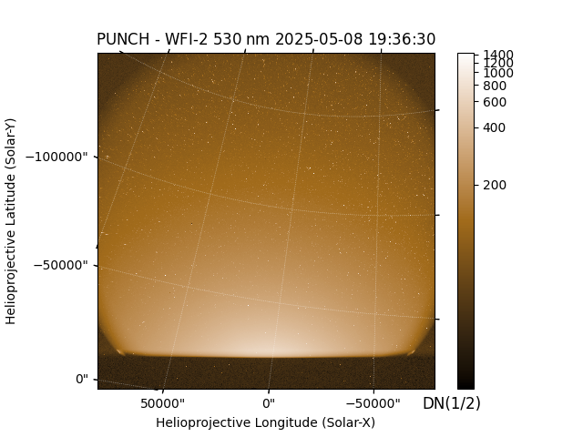
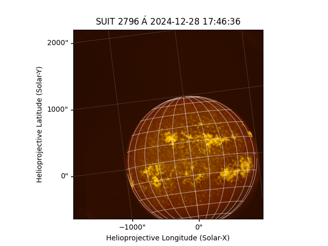

.. _whatsnew-7.0:

************************
What's New in sunpy 7.0?
************************

The SunPy Project is pleased to announce the 7.0 release of the ``sunpy`` core package.

On this page, you can read about some of the big changes in this release.

.. contents::
    :local:
    :depth: 1

``sunpy`` 7.0 also includes a large number of smaller improvements and bug fixes, which are described in the :ref:`changelog`.

* 515 commits have been added since 6.1
* 23 issues have been closed since 6.1
* 63 pull requests have been merged since 6.1
* 26 people have contributed since 6.1
* 8 of which are new contributors

The people who have contributed to the code for this release are:

-  Ahmed Hossam
-  Albert Y. Shih
-  Ankit Khushwaha
-  Aritra Sinha
-  Brett J Graham
-  Chris Lowder  *
-  Chris R. Gilly
-  David Pérez-Suárez
-  David Stansby
-  Diya Khetarpal
-  FreyaJain  *
-  Hardik  *
-  Laura Hayes
-  Manish Tiwari  *
-  Mingyu Jeon  *
-  Nabil Freij
-  Ole Streicher
-  Pratham Hole
-  Prisha Sharma  *
-  Rahul Gopalakrishnan  *
-  Saurav Kumar Roy
-  Shane Maloney
-  Stuart J. Mumford
-  Tanish Yelgoe
-  Will Barnes
-  _Gagan  *

Where a * indicates that this release contains their first contribution to sunpy.

Updates to minimum dependencies
===============================

The minimum required versions of the following packages have been updated:

- python>=3.11
- astropy>=6.1
- numpy>=1.25.0
- parfive>=2.1.0
- packaging>=23.2
- requests>=2.32.0
- fsspec>=2023.6.0
- asdf>=3.0.0
- scipy>=1.11.0
- glymur>=0.13.0
- contourpy>=1.1.0
- matplotlib>=3.8.0
- mpl-animators>=1.2.0
- reproject>=0.12.0
- scipy>=1.11.0
- opencv-python>=4.8.0.74
- beautifulsoup4>=4.13.0
- python-dateutil>=2.9.0
- tqdm>=4.66.0
- zeep>=4.3.0
- scikit-image>=0.21.0
- spiceypy>=6.0.0
- h5netcdf>=1.2.0
- h5py>=3.9.0
- pandas>=2.1.0
- aiobotocore>=2.6.0

Added support for new observatories
===================================

There is now support for Polarimeter to Unify the Corona and Heliosphere (PUNCH) level 3 products within sunpy.

As well as for the Solar Ultraviolet Imaging Telescope (SUIT) onboard the Aditya-L1 mission.

Broadened support for existing observatories
============================================

Added support for the latest level 1 files for SOHO's Extreme ultraviolet Imaging Telescope (EIT).
Additionally, support for the Global Oscillation Network Group (GONG) magnetogram files.

Maps now plot with auto-alignment by default
=============================================

The "auto-alignment" functionality of the `~sunpy.map.Map` method :meth:`~sunpy.map.GenericMap.plot` has been significantly enhanced and is now enabled by default.
This functionality draws the map's pixels in a coordinate-aware fashion when plotting the map on coordinate axes that may be in a different projection or even a different coordinate frame.
The previously available mesh-based approach (``autoalign='mesh'``) draws each map pixel individually, and has been sped up dramatically.
The newly available image-based approach (``autoalign='image'``) draws a warped version of the map as a single image, which is usually faster than the image-based approach, but has some limitations.
The default setting (``autoalign=True``) makes an automatic determination of whether to use the mesh-based approach or the image-based approach.

.. minigallery:: ../examples/map_transformations/autoalign_aia_hmi.py

This auto-alignment functionality is for visualization purposes.
For other data-analysis needs, such as co-adding images, reprojecting the map using :meth:`~sunpy.map.GenericMap.reproject_to` may be more appropriate.

Automatic determination of extent for reprojections
===================================================

You can now enable the automatic determination of extent for reprojections through the keyword ``auto_extent`` for the `~sunpy.map.Map` method :meth:`~sunpy.map.GenericMap.reproject_to`.

.. minigallery:: ../examples/map_transformations/reprojection_auto_extent.py

Using a screen with differential rotation
=========================================

When working with off-disk 2D coordinates, applying a screen assumption (:func:`~sunpy.coordinates.PlanarScreen` or :func:`~sunpy.coordinates.SphericalScreen`) is now fully compatible with applying differential rotation (:func:`~sunpy.coordinates.propagate_with_solar_surface`).
Most usefully, off-disk data will be preserved when reprojecting a map.

.. minigallery:: ../examples/differential_rotation/reprojected_map.py

As a note of caution, drawing gridlines on the differentially rotated screen can take a lot of computing time.

Access to the JSOC AIA "synoptic" data
======================================

It is now possible to  download the "synoptic" AIA data from the JSOC.
This dataset is not synoptic like HMI and MDI Synoptic images which are images of the solar surface reconstructed from many observations over a solar rotation but rather a synopsis of AIA data.
The AIA synoptic data are calibrated Level 1.5 images with reduced 1k x 1k resolution at regular 2-minute cadence.
This is not a DRMS series, it is served by a HTTPS server.
It supports filtering by a single wavelength or sample rate.

.. code-block:: python

    >>> from sunpy.net import Fido, attrs as a
    >>> results = Fido.search(a.Time("2016/1/1", "2016/1/1 00:01:00"),
    ...                       a.Instrument.aia, a.Level("1.5s"))  # doctest: +REMOTE_DATA
    >>> results  # doctest: +REMOTE_DATA
    <sunpy.net.fido_factory.UnifiedResponse object at ...>
    Results from 1 Provider:
    <BLANKLINE>
    9 Results from the AIASynopsisClient:
    Source: https://jsoc1.stanford.edu/data/aia/synoptic/
    <BLANKLINE>
           Start Time               End Time        Instrument  Physobs  Source Provider Level Wavelength
    ----------------------- ----------------------- ---------- --------- ------ -------- ----- ----------
    2016-01-01 00:00:00.000 2016-01-01 00:00:59.999        AIA intensity    SDO     JSOC  1.5S         94
    2016-01-01 00:00:00.000 2016-01-01 00:00:59.999        AIA intensity    SDO     JSOC  1.5S        131
    2016-01-01 00:00:00.000 2016-01-01 00:00:59.999        AIA intensity    SDO     JSOC  1.5S        171
    2016-01-01 00:00:00.000 2016-01-01 00:00:59.999        AIA intensity    SDO     JSOC  1.5S        193
    2016-01-01 00:00:00.000 2016-01-01 00:00:59.999        AIA intensity    SDO     JSOC  1.5S        211
    2016-01-01 00:00:00.000 2016-01-01 00:00:59.999        AIA intensity    SDO     JSOC  1.5S        304
    2016-01-01 00:00:00.000 2016-01-01 00:00:59.999        AIA intensity    SDO     JSOC  1.5S        335
    2016-01-01 00:00:00.000 2016-01-01 00:00:59.999        AIA intensity    SDO     JSOC  1.5S       1600
    2016-01-01 00:00:00.000 2016-01-01 00:00:59.999        AIA intensity    SDO     JSOC  1.5S       4500
    <BLANKLINE>
    <BLANKLINE>

Improved return types from the `~sunpy.net.hek.HEKClient`
=========================================================

The `~sunpy.net.hek.HEKClient` now returns `~astropy.units.Quantity`, `~astropy.time.Time`, and `~astropy.coordinates.SkyCoord` objects wherever possible.
This allows for easier interpretation of results from the Heliophysics Event Knowledgebase, particularly when it comes to coordinates and bounding boxes.
Users should be aware that some redundant columns are now dropped from the results table (e.g. those columns which only contained unit information).
The original, unparsed response from the HEK can be accessed via the ``raw`` property on `~sunpy.net.hek.HEKTable`.
