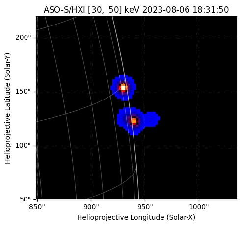

.. _whatsnew-7.1:

************************
What's New in sunpy 7.1?
************************

The SunPy Project is pleased to announce the 7.1 release of the ``sunpy`` core package.

On this page, you can read about some of the big changes in this release.

.. contents::
    :local:
    :depth: 1

This release of sunpy contains 329 commits in 66 merged pull requests closing 24 issues from 17 people, 5 of which are first-time contributors to sunpy.

* 329 commits have been added since 7.0
* 24 issues have been closed since 7.0
* 66 pull requests have been merged since 7.0
* 17 people have contributed since 7.0
* 5 of which are new contributors

The people who have contributed to the code for this release are:

-  Alasdair Wilson
-  Albert Y. Shih
-  Brett J Graham
-  Conor MacBride
-  David Stansby
-  Fu Yu  *
-  Haruhisa Iijima  *
-  Maya Mohamed  *
-  Nabil Freij
-  Pratham Hole
-  Samuel Jackson  *
-  Saurav Kumar Roy
-  Shane Maloney
-  Stuart J. Mumford
-  Tanish Yelgoe
-  Will Barnes
-  eebbaaf  *

Where a * indicates that this release contains their first contribution to sunpy.

Updates to minimum dependencies
===============================

The minimum required versions of the following packages have been updated:

- python>=3.12
- astropy>=6.1
- h5py>=3.10.0
- lxml>=5.0.1
- matplotlib>=3.8.0
- numpy>=1.26.0
- pandas>=2.2.0
- reproject>=0.13.0
- scipy>=1.12.0

SOLARNET Support
================

Added support for querying data from `solarnet API <https://solarnet.oma.be/>`__ using a new `~sunpy.net.solarnet.SOLARNETClient`.

.. code-block:: python

    >>> from sunpy.net import Fido, attrs as a  # doctest: +REMOTE_DATA
    >>> result = Fido.search(a.Time('2023-01-01', '2023-01-02'), a.solarnet.Dataset.eui_level_2, a.solarnet.Limit(2))  # doctest: +REMOTE_DATA
    >>> result  # doctest: +REMOTE_DATA
    <sunpy.net.fido_factory.UnifiedResponse object at ...>
    Results from 1 Provider:
    <BLANKLINE>
    2 Results from the SOLARNETClient:
    Source: https://solarnet2.oma.be
    <BLANKLINE>
           OID                 DATE_BEG                 DATE_END         WAVEMIN WAVEMAX         DATE_OBS
    ------------------ ------------------------ ------------------------ ------- ------- ------------------------
    20230101T000005185 2023-01-01T00:00:05.185Z 2023-01-01T00:16:45.185Z    17.1    18.5 2023-01-01T00:00:05.185Z
    20230101T001805186 2023-01-01T00:18:05.186Z 2023-01-01T00:34:45.186Z    17.1    18.5 2023-01-01T00:18:05.186Z
    <BLANKLINE>
    <BLANKLINE>

Added support for new observatories
===================================

Added a new map source for the ASO-S mission, currently added `~sunpy.map.sources.HXIMap` for the Hard X-ray Imager (HXI) payload, which enables the loading of the hard X-ray imaging FITS file that was exported from the HXI analysis software.

Fido.search will now continue on error
======================================

We have enhanced `sunpy.net.Fido`'s ``search`` method to be continue if a client errors on search.

Now all queries will have an ``.errors`` property that contains any client errors that occurred during the search as the search completes.

Preserving the observation time of a map when reprojecting
==========================================================

When calling `~sunpy.map.GenericMap.reproject_to`, it is now possible to preserve the original observation time
of the map when reprojecting to a new WCS through the ``preserve_date_obs`` keyword argument. This does not affect
the reprojection itself, which instead depends on the reference times of the two coordinate frames. This is useful,
for example, when reprojecting a series of images to a common coordinate frame and you want to preserve the
original observation time of each image.

.. minigallery:: ../examples/map/track_active_region.py
