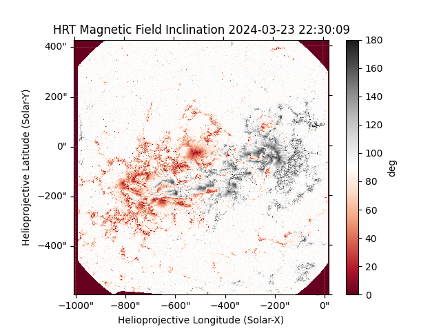
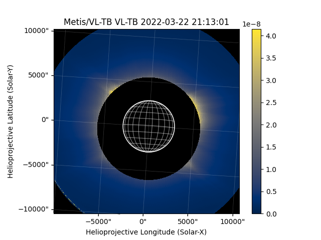

.. _whatsnew-8.0:

************************
What's New in sunpy 8.0?
************************

The SunPy Project is pleased to announce the 8.0 release of the ``sunpy`` core package.

On this page, you can read about some of the big changes in this release.

.. contents::
    :local:
    :depth: 1

``sunpy`` 8.0 also includes a large number of smaller improvements and bug fixes, which are described in the :ref:`changelog`.

This release of sunpy contains 491 commits in 76 merged pull requests closing 64 issues from 19 people, 7 of which are first-time contributors to sunpy.

* 491 commits have been added since 7.1
* 64 issues have been closed since 7.1
* 76 pull requests have been merged since 7.1
* 19 people have contributed since 7.1
* 7 of which are new contributors

The people who have contributed to the code for this release are:

-  Alasdair Wilson
-  Albert Y. Shih
-  Aleksandr Burtovoi  *
-  Clément Robert
-  Daragh M. Hollman  *
-  David Stansby
-  Giovanna Jerse  *
-  Herman le Roux  *
-  Jonas Sinjan  *
-  Kumar Amityush  *
-  Laura Hayes
-  Manit Singh
-  Nabil Freij
-  Rahul Gopalakrishnan
-  Samuel Bennett
-  Shane Maloney
-  Stuart J. Mumford
-  Will Barnes
-  Yaocheng Chen  *

Where a * indicates that this release contains their first contribution to sunpy.

Updates to minimum dependencies
===============================

The minimum required versions of the following packages have been updated:

- asdf >=3.3.0
- asdf-astropy >=0.7.0
- astropy >=7.0.0
- contourpy >=1.3.0
- dask >=2024.6.0
- drms >=0.8.0
- fsspec >=2024.9.0
- glymur >=0.14.0.post1
- h5netcdf >=1.4.0
- h5py >=3.12.0
- lxml >=5.3.0
- matplotlib >=3.10.0
- numpy >=2.0.0
- packaging >=24.2
- pandas >=2.3.0
- parfive >=2.2.0
- reproject >=0.14.0
- requests >=2.33.0
- scikit-image >=0.24.0
- scipy >=1.14.0
- spiceypy >=7.0.0
- tqdm >=4.67.0

Added support for PHI and Metis Instruments on Solar Orbiter
============================================================

This release adds two new map sources for the Polarimetric and Helioseismic Imager (PHI) and Metis on the Solar Orbiter mission.

Merged Solar Orbiter Archive (SOAR) Fido support into ``sunpy``
===============================================================

The Fido client for the SOAR has been developed for a number of years in the ``sunpy_soar`` affiliated package.
As this has reached a suitable level of maturity, this has now been merged into ``sunpy``.
The ``sunpy_soar`` package will now be deprecated, and SOAR support will be maintained within ``sunpy`` core going forward.

.. code-block:: python

    >>> import sunpy.net.attrs as a
    >>> from sunpy.net import Fido

    >>> instrument = a.Instrument("EUI")
    >>> time = a.Time("2021-02-01", "2021-02-02")
    >>> level = a.Level(1)
    >>> product = a.soar.Product("EUI-FSI174-IMAGE")

    >>> Fido.search(instrument & time & level & product)  # doctest: +REMOTE_DATA
    <sunpy.net.fido_factory.UnifiedResponse object at ...>
    Results from 1 Provider:
    <BLANKLINE>
    ... Results from the SOARClient:
    <BLANKLINE>
    Instrument   Data product   Level        Start time               End time        Filesize SOOP Name Detector Wavelength
                                                                                       Mbyte
    ---------- ---------------- ----- ----------------------- ----------------------- -------- --------- -------- ----------
           EUI eui-fsi174-image    L1 2021-02-01 00:45:12.228 2021-02-01 00:45:22.228    3.393      none      FSI      174.0
    ...
           EUI eui-fsi174-image    L1 2021-02-01 23:45:12.242 2021-02-01 23:45:22.242    0.415      none      FSI      174.0
    <BLANKLINE>
    <BLANKLINE>

.. minigallery::
   :add-heading: Examples of searching the SOAR
   :heading-level: -

   ../examples/acquiring_data/soar_*
   ../examples/acquiring_data/solo_vso_eui.py

New Examples in the Gallery
===========================

To coincide with the Solar Orbiter theme of the 8.0 a number of new examples using Solar Orbiter data have been added:

.. minigallery::

   ../examples/showcase/spice_parallel_fitting.py
   ../examples/map_transformations/solo_phi_reproject.py
   ../examples/units_and_coordinates/solo_fov.py
   ../examples/plotting/phi_example.py
   ../examples/map/plotting_metis_data.py

In addition to this some other examples have been added:

.. minigallery::

   ../examples/showcase/artemis-ii*
   ../examples/map/interactive_point_selection.py

Saving SunPy Coordinates with Astropy Table
===========================================

It's now possible to save the coordinate frames provided by ``sunpy`` to various file formats supported by Astropy Table
An Astropy `~astropy.table.Table` object with a column which is a `~astropy.coordinates.SkyCoord` with frame defined in ``sunpy`` can be written to formats which support :ref:`mixin_columns`, for example :ref:`ecsv_format`.

.. code-block:: python

    >>> import astropy.units as u
    >>> from astropy.coordinates import SkyCoord
    >>> from astropy.table import QTable
    >>> import sunpy.coordinates

    >>> coords = SkyCoord([1, 2, 3], [3, 2, 1], unit=u.arcsec, frame="helioprojective")
    >>> table = QTable({"pos": coords})
    >>> table
    <QTable length=3>
         pos
    arcsec,arcsec
       SkyCoord
    -------------
          1.0,3.0
          2.0,2.0
          3.0,1.0

    >>> table.write("my_coordinates.ecsv")  # doctest: +SKIP
